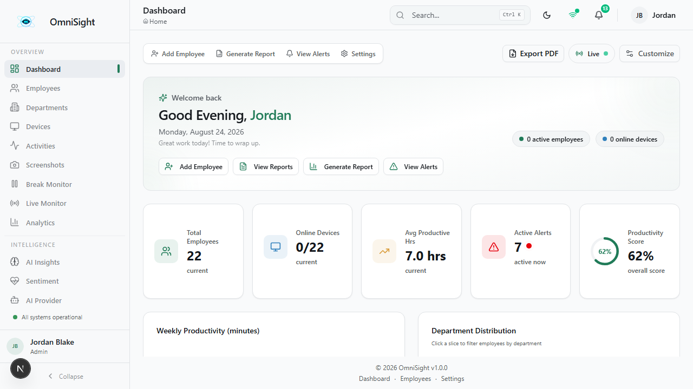
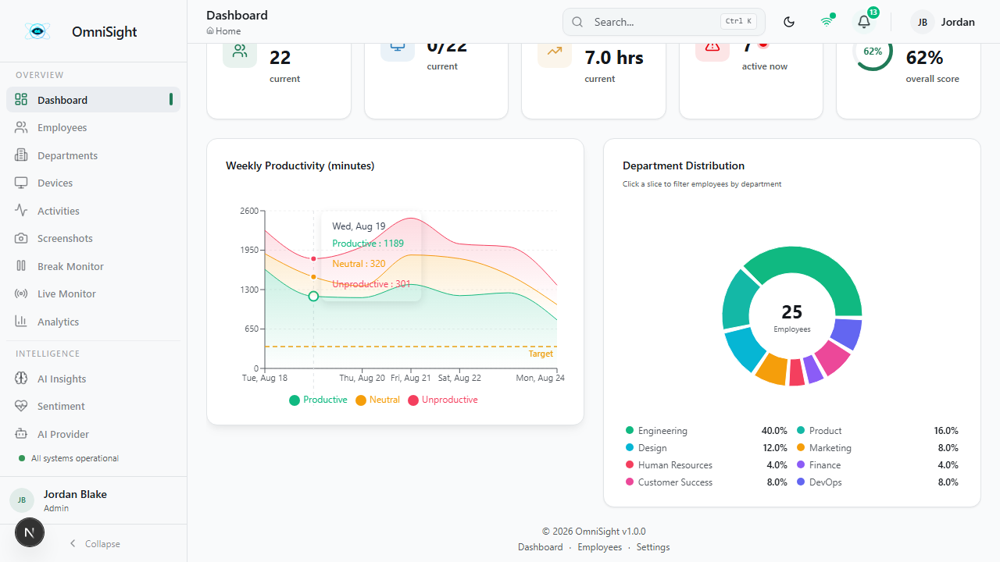
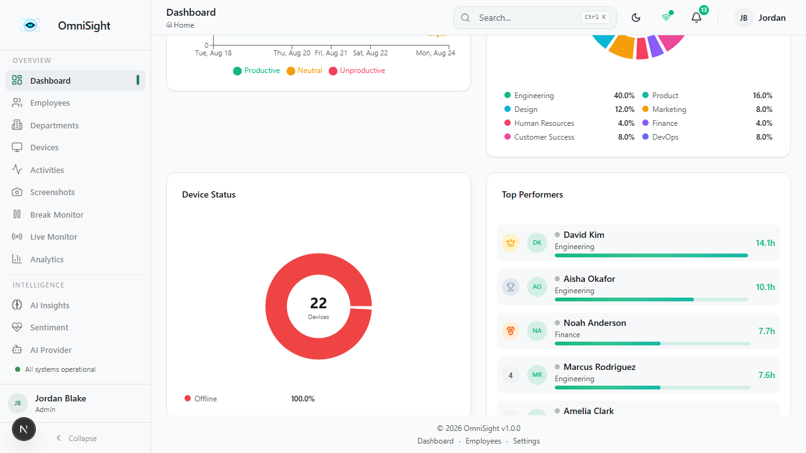
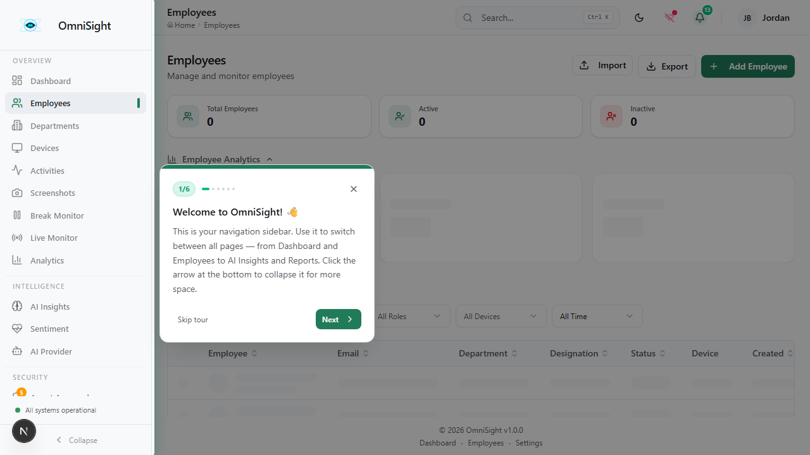
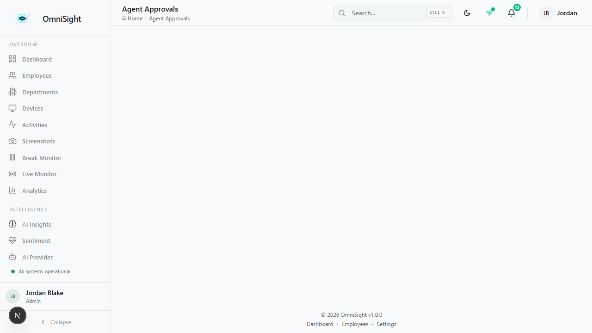
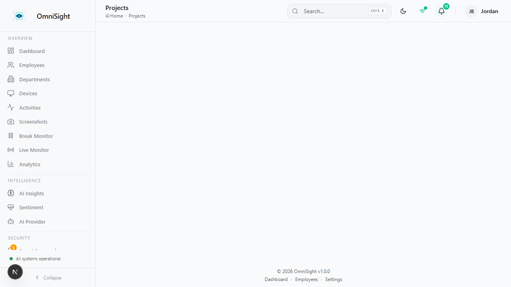
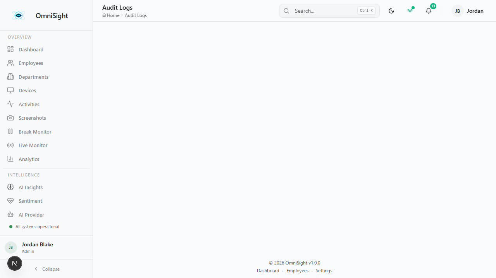

# OmniSight

## Company Guidance & Administrator User Manual

---

**Version 1.0**

**Documentation Date: August 2026**

**For Organization Administrators**

---

*This document is the official user guidance manual for the OmniSight Workforce Intelligence Platform. It is intended for company management, organization administrators, and authorized staff who will use this system in their daily operations.*

---

# Table of Contents

1. [Cover Page](#1-cover-page)
2. [Product Overview](#2-product-overview)
3. [Getting Started](#3-getting-started)
4. [Dashboard](#4-dashboard)
5. [Employee / User Management](#5-employee--user-management)
6. [Device / Service App Management](#6-device--service-app-management)
7. [Monitoring Features](#7-monitoring-features)
8. [Tasks & Projects](#8-tasks--projects)
9. [Analytics](#9-analytics)
10. [Reports](#10-reports)
11. [Notifications / Alerts](#11-notifications--alerts)
12. [Organization Settings](#12-organization-settings)
13. [Administrator Permissions / RBAC](#13-administrator-permissions--rbac)
14. [Recommended Daily Workflow](#14-recommended-daily-workflow)
15. [Common Operational Scenarios](#15-common-operational-scenarios)
16. [Troubleshooting Guide](#16-troubleshooting-guide)
17. [Feature Reference Table](#17-feature-reference-table)
18. [Screenshot Index](#18-screenshot-index)

---

# 1. Cover Page


**Figure 1 — OmniSight Login Screen**

---

# 2. Product Overview

## What OmniSight Is

OmniSight is a **Workforce Intelligence Platform** that gives company administrators centralized visibility into employee activity, device health, productivity, and security across the entire organization.

## What Problem It Solves

Modern companies need to understand how their workforce uses technology. OmniSight answers critical questions:

- Are employees productive during work hours?
- Are company devices healthy and secure?
- Are there security risks or policy violations?
- How is work distributed across teams?

## Who Should Use It

| Role | Access Level |
|------|-------------|
| **Organization Administrator** | Full access to all features |
| **Manager** | Department-level monitoring, project management |
| **Viewer** | Read-only access to dashboards and reports |

## What an Administrator Can Manage

- **Employees** — Add, edit, archive, and monitor workforce
- **Devices** — Approve, assign, and track company computers
- **Activity** — Monitor application and website usage
- **Security** — Detect anomalies, enforce policies, manage consent
- **Projects** — Track work, time, and productivity
- **Analytics** — Review trends and generate reports

## Main Areas of the Platform

| Area | Purpose |
|------|---------|
| **Dashboard** | Real-time overview of workforce activity |
| **Employees** | Manage your workforce roster |
| **Devices** | Monitor and control company devices |
| **Monitoring** | Activity, screenshots, location, and more |
| **Analytics** | Productivity insights and trends |
| **Security** | Anomaly detection, policies, consent |
| **Projects** | Work management and time tracking |
| **Settings** | System configuration |

---

# 3. Getting Started

## How to Access the Application

1. Open your web browser
2. Navigate to your organization's OmniSight URL
3. You will see the login screen

## How to Log In


**Figure 2 — Login Screen**

**Step 1:** Enter your administrator email address

**Step 2:** Enter your password

**Step 3:** Click **Sign In**

> **Note:** Passwords are securely encrypted. After 5 failed login attempts, the account is locked for 15 minutes for security.

## What Happens After Login

After successful login, you are taken to the **Dashboard** — the main overview of your workforce activity.

## How to Navigate the Main Interface

The interface consists of three main areas:

1. **Sidebar** (left) — Navigation to all pages
2. **Header** (top) — Page title, search, theme toggle
3. **Main Content** (center) — The current page content

### Sidebar Navigation

The sidebar organizes features into logical groups:

| Section | Pages |
|---------|-------|
| **Overview** | Dashboard, Employees, Departments, Devices, Activities, Screenshots, Break Monitor, Live Monitor, Analytics |
| **Intelligence** | AI Insights, Sentiment, AI Provider |
| **Security** | Agent Approvals, Guests, Notifications, Alerts, Audit Logs, Agent Security, Policies, Anomaly Detection, Consent |
| **Work Management** | Projects |
| **Employee** | Employee Portal |
| **Admin** | Organization, Reports, Daily Report, Settings |

**To navigate:** Click any item in the sidebar to go to that page.

**To collapse the sidebar:** Click the arrow at the bottom for more screen space.

---

# 4. Dashboard

## What is the Dashboard?

The Dashboard is your command center — showing real-time workforce activity at a glance.

## Where is it?

**Sidebar → Dashboard** (first item)

## How does it work?

The Dashboard automatically updates with the latest data from your workforce.

## What should I look for?


**Figure 3 — Main Dashboard**

### Dashboard Sections Explained

| # | Section | What It Shows | Why It Matters |
|---|---------|---------------|----------------|
| 1 | **Total Employees** | Number of employees in the organization | Know your headcount at a glance |
| 2 | **Total Devices** | Number of registered devices | Understand your device fleet |
| 3 | **Online Devices** | Currently active devices | Real-time connectivity status |
| 4 | **Productivity Score** | Overall productivity rating (0-100) | Quick health check of workforce |
| 5 | **Active Alerts** | Unresolved alerts requiring attention | Immediate action items |

### Recent Activity Feed

The activity feed shows the latest activity from all monitored devices:

- Application names and durations
- Website visits and categories
- Employee name and device
- Timestamp and productivity category

### Productivity Distribution

Visual breakdown showing:

- **Productive time** — Work-related applications
- **Neutral time** — Communication, email
- **Unproductive time** — Non-work browsing

### Department Performance

Side-by-side comparison of activity levels across departments.

## What can I do from the Dashboard?

- View real-time workforce activity
- Identify productivity trends
- Spot alerts requiring attention
- Click through to detailed employee or device views
- Use as the starting point for any investigation



**Figure 4 — Dashboard Top Section**



**Figure 5 — Dashboard Middle Section**



**Figure 6 — Dashboard Bottom Section**

---

# 5. Employee / User Management

## What is Employee Management?

Employee Management lets you add, view, edit, and monitor your workforce.

## Where is it?

**Sidebar → Employees**

## Viewing Employees



**Figure 7 — Employee Management Page**

The employee list shows all employees with key information:

| Column | Information |
|--------|-------------|
| **Name** | Employee name and ID |
| **Email** | Contact email |
| **Department** | Assigned department |
| **Designation** | Job title |
| **Status** | Active, Inactive, or Archived |
| **Device** | Assigned device name |
| **Join Date** | When they joined |

### Search and Filters

- **Search** — Find employees by name or email
- **Department Filter** — Filter by department
- **Status Filter** — Filter by active/inactive/archived

## Adding an Employee

**Step 1:** Open the Employees page

**Step 2:** Click **Add Employee**

**Step 3:** Fill in the required information:

- First Name
- Last Name
- Email Address
- Employee ID
- Department
- Designation
- Join Date

**Step 4:** Click **Save**

**Step 5:** Verify the employee appears in the list

### Bulk Import

For adding multiple employees at once:

1. Click **Import**
2. Download the CSV/Excel template
3. Fill in employee data
4. Upload the file
5. Review and confirm

## Employee Details


**Figure 8 — Employee Detail Overview**

Each employee has a detailed profile showing:

- **Profile Card** — Name, ID, status, designation
- **Productivity Score** — 0-100% rating
- **Period Statistics** — Total hours, productive time, average daily
- **Active Days** — Count of active work days
- **Quick Actions** — Edit, Export, PDF Report, Archive

### Employee Detail Tabs

The employee detail page has multiple tabs for different aspects:

#### Activity Tab


**Figure 9 — Employee Activity Tab**

Shows chronological list of all activities:

- Application and website usage
- Duration and productivity category
- Timestamps and device information

#### Apps & Websites Tab


**Figure 10 — Employee Apps & Websites Tab**

Shows most used applications ranked by time:

- Website visit history
- Productivity breakdown per app
- Time spent in each application

#### Timeline Tab


**Figure 11 — Employee Timeline Tab**

Visual timeline of the day's activity:

- Work sessions and breaks
- Application switches
- Idle periods
- Color-coded by activity type

#### Keyboard Tab


**Figure 12 — Employee Keyboard Statistics Tab**

Privacy-safe keyboard metrics:

- Aggregate keystroke counts (no raw key data)
- Active typing seconds per interval
- Application-specific typing stats

#### Location Tab


**Figure 13 — Employee Location Tab**

GPS location information (requires consent):

- GPS coordinates from device
- Location history with timestamps
- Accuracy radius
- Map visualization

#### Webcam Tab


**Figure 14 — Employee Webcam Tab**

On-demand webcam session control:

- Session history and status
- Start/Stop webcam commands
- Frames are never stored (relay only)

#### Devices Tab


**Figure 15 — Employee Devices Tab**

Shows assigned device information:

- Device status (online/offline)
- Agent version and heartbeat
- Hardware specifications

#### Alerts Tab


**Figure 16 — Employee Alerts Tab**

Alerts specific to this employee:

- Security events
- Anomaly detections
- Policy violations

## Editing Employees


**Figure 17 — Employee Edit Form**

**Step 1:** Open the employee's detail page

**Step 2:** Click **Edit**

**Step 3:** Modify the necessary fields

**Step 4:** Click **Save**

### Available Employee Actions

| Action | Description |
|--------|-------------|
| **Edit** | Update employee information |
| **Export** | Download employee data |
| **PDF Report** | Generate employee report |
| **Archive** | Move employee to archived status |

### Employee Status

| Status | Meaning |
|--------|---------|
| **Active** | Currently employed and monitored |
| **Inactive** | Temporarily not monitored (e.g., leave of absence) |
| **Archived** | No longer with the company (data retained for compliance) |

## Departments


**Figure 18 — Department Management**

Departments organize employees into functional groups:

- Engineering, Product, Design, Marketing, HR, Finance, Customer Success, DevOps
- Each department can have a designated manager
- Departments are used for analytics, reporting, and project assignments

---

# 6. Device / Service App Management

## What is Device Management?

Device Management lets you monitor, approve, and control all company computers.

## Where is it?

**Sidebar → Devices**

## The Device Lifecycle

```
Enrollment → Approval → Assignment → Active Device → Monitoring → Offline/Online Status
```

## Viewing Devices


**Figure 19 — Device Management Page**

The device list shows all registered computers:

| Field | Description |
|-------|-------------|
| **Device Name** | Employee-assigned name (e.g., "Sarah-Chen-Laptop") |
| **Hostname** | System hostname (e.g., "ACME-001") |
| **Operating System** | Windows 11, Windows 10, macOS, Ubuntu |
| **Status** | Online, Offline, Inactive, Maintenance, Retired |
| **Agent Version** | Installed agent software version |
| **Last Heartbeat** | Most recent communication with the server |
| **Assigned Employee** | Employee the device belongs to |

## Device Status

| Status | Meaning |
|--------|---------|
| **Online** | Device is active and sending telemetry |
| **Offline** | Device hasn't communicated recently |
| **Inactive** | Device has been deauthorized |
| **Maintenance** | Device is under maintenance |
| **Retired** | Device is no longer in use |

## Device Details


**Figure 20 — Device Detail View**

Shows comprehensive device information:

- Hardware specifications (processor, memory, OS version)
- Network information (IP address, MAC address)
- Agent version and last heartbeat
- Assigned employee
- Device status indicator

## Device Approval Workflow



**Figure 21 — Agent Approvals**

When a new device attempts to connect:

**Step 1:** The agent installs and contacts the server

**Step 2:** Device appears in Agent Approvals queue

**Step 3:** Admin reviews device details and employee assignment

**Step 4:** Admin approves or rejects the device

**Step 5:** Approved device begins sending telemetry

### Approval Actions

| Action | Description |
|--------|-------------|
| **Approve** | Allow the device to connect and start monitoring |
| **Reject** | Deny the device access |
| **View Details** | See full device information before deciding |

## Guests (Zero-Touch Enrollment)


**Figure 22 — Guest Management**

For temporary or contractor devices without employee credentials:

- Zero-touch enrollment without employee account creation
- Guest status tracking (Pending → Active → Suspended/Revoked)
- Limited monitoring scope based on consent

---

# 7. Monitoring Features

## 7.1 Activity Monitoring

### What is it?

Activity Monitoring tracks application usage and website visits across all monitored devices.

### Where is it?

**Sidebar → Activities**

### How does it work?


**Figure 23 — Activity Monitoring**

The system automatically records:

- Application name and executable
- Duration of use
- Productivity category
- Timestamp
- Employee and device association

### Activity Categories

| Category | Examples |
|----------|----------|
| **Productive** | VS Code, Jira, Slack, Teams, Figma, Terminal |
| **Neutral** | Spotify, Discord, Outlook |
| **Unproductive** | YouTube, Reddit, Twitter, Facebook |

### Filtering and Search

- Filter by employee, department, date range
- Filter by productivity category
- Search by application name or URL
- Sort by duration, timestamp, or category

### What can I do?

- Review employee productivity patterns
- Identify time-wasting applications
- Track work hours and breaks
- Generate productivity reports

---

## 7.2 Screenshots

### What is it?

Periodic screen captures provide visual context of employee work.

### Where is it?

**Sidebar → Screenshots**

### How does it work?


**Figure 24 — Screenshot Monitoring**

| Feature | Description |
|---------|-------------|
| **Periodic Capture** | Configurable interval (default: 10 minutes) |
| **OCR Text** | Extracted text from screenshots for search |
| **AI Analysis** | Automated content analysis |
| **Flagging** | Screenshots flagged for containing sensitive data |
| **Blur Score** | Quality/blur assessment |
| **App Window** | Which application was in focus |

### What can I do?

- View full-size screenshots
- Search by OCR text content
- Filter by employee, date, application
- Flag/unflag screenshots for review
- AI analysis for content understanding

---

## 7.3 Break Monitor

### What is it?

Tracks employee break/privacy mode sessions.

### Where is it?

**Sidebar → Break Monitor**

### How does it work?


**Figure 25 — Break Monitor**

- Real-time break status for all employees
- Break history with duration and source
- Admin-initiated breaks (for privacy/compliance)
- Employee self-service breaks via agent

### What can I do?

- Monitor who is currently on break
- View break history and patterns
- Start/end breaks on behalf of employees
- Analyze break compliance

---

## 7.4 Live Monitor

### What is it?

Real-time event stream showing all system activity as it happens.

### Where is it?

**Sidebar → Live Monitor**

### How does it work?


**Figure 26 — Live Monitor**

### Events Tracked

- Device connections/disconnections
- Activity start/end
- Screenshot captures
- Policy violations
- Anomaly detections
- USB events
- Break sessions

### What can I do?

- Watch real-time system activity
- Filter by event type
- Identify issues as they happen
- Monitor device connectivity

---

## 7.5 Location Tracking

### What is it?

GPS location information from employee devices (requires consent).

### Where is it?

**Employee Detail → Location Tab**

### How does it work?


**Figure 27 — Location Tracking**

- GPS coordinates from device
- Location history with timestamps
- Accuracy radius
- Map visualization

### What should I look for?

- Location during work hours
- Unusual location patterns
- Travel and remote work verification

> **Note:** Location tracking requires explicit employee consent and must be enabled in settings.

---

## 7.6 Keyboard Statistics

### What is it?

Aggregate keyboard activity metrics (no raw key data captured).

### Where is it?

**Employee Detail → Keyboard Tab**

### How does it work?


**Figure 28 — Keyboard Statistics**

- Aggregate keystroke counts (physical presses)
- Active typing seconds per interval
- Application-specific typing stats
- Privacy-safe metrics only

> **Important:** OmniSight never captures or stores raw keystrokes. Only aggregate counts and active typing time are recorded.

---

## 7.7 Webcam Sessions

### What is it?

On-demand webcam relay for visual verification (frames never stored).

### Where is it?

**Employee Detail → Webcam Tab**

### How does it work?


**Figure 29 — Webcam Control**

- Start/Stop webcam commands
- Session history and status
- Active session indicator
- Frames are relayed only, never persisted

### What can I do?

- Initiate webcam session when needed
- View session history
- End active sessions

> **Note:** Webcam access requires explicit employee consent.

---

# 8. Tasks & Projects

## What is it?

Project Management lets you create projects, assign team members, and track time.

## Where is it?

**Sidebar → Projects**

## How does it work?



**Figure 30 — Project Management**

### Project Features

| Feature | Description |
|---------|-------------|
| **Create Projects** | Name, description, status, priority, deadlines |
| **Assign Members** | Add employees with roles (lead, member, reviewer, stakeholder) |
| **Track Time** | Manual time entries + automatic activity-based tracking |
| **Budget Management** | Fixed price, hourly, or retainer billing |
| **Status Tracking** | Active, On Hold, Completed, Cancelled |

## Project Detail View


**Figure 31 — Project Detail**

Shows:

- Project overview and description
- Team members and their roles
- Time entries (manual and auto-tracked)
- Budget and estimated hours
- Tags and color coding

## How to Create a Project

**Step 1:** Open the Projects page

**Step 2:** Click **Create Project**

**Step 3:** Fill in project details:

- Name
- Description
- Status (Active/On Hold/Completed/Cancelled)
- Priority (Low/Medium/High/Critical)
- Start Date
- Deadline
- Estimated Hours
- Budget Type

**Step 4:** Add team members

**Step 5:** Save the project

## Time Tracking

### Manual Entries

Admins can log time on behalf of employees:

1. Open project detail
2. Click **Add Time Entry**
3. Select employee, date, hours
4. Enter description and category
5. Save

### Auto-Tracked Time

Activity data is automatically attributed to project time:

- Based on employee project membership
- Activity categorized by application usage
- Aggregated per employee per day

### Time Entry Categories

| Category | Examples |
|----------|----------|
| Development | Coding, debugging, code review |
| Design | UI/UX work, mockups |
| Meeting | Stand-ups, planning, reviews |
| Research | Documentation, investigation |
| Testing | QA, test writing |
| Review | Code review, document review |
| Admin | Administrative tasks |

---

# 9. Analytics

## What is it?

Analytics provides visual insights into workforce productivity and patterns.

## Where is it?

**Sidebar → Analytics**

## How does it work?


**Figure 32 — Analytics Dashboard**

### Key Analytics

| Metric | What It Measures | What You Can Learn |
|--------|------------------|-------------------|
| **Productivity Trends** | Daily/weekly productivity over time | Are teams getting more or less productive? |
| **Department Comparison** | Productivity by department | Which teams are performing best? |
| **Workload Distribution** | How work is distributed across team | Is work balanced fairly? |
| **Application Usage** | Most used applications | What tools are being used? |
| **Peak Hours** | Busiest work periods | When is the team most active? |
| **Idle Time Analysis** | When employees are most/least active | Are there productivity gaps? |

### Analytics Filters

- **Date Range** — Daily, weekly, monthly, custom
- **Department** — Focus on specific team
- **Employee** — Individual analysis
- **Application Category** — Productive vs. unproductive

### How to Interpret the Data

1. **Look for trends** — Is productivity increasing or decreasing over time?
2. **Compare departments** — Are some teams more productive than others?
3. **Identify patterns** — Are there consistent peak/trough periods?
4. **Spot anomalies** — Any sudden changes that need investigation?

---

# 10. Reports

## What is it?

Generate and manage workforce reports for management review.

## Where is it?

**Sidebar → Reports**

## How does it work?


**Figure 33 — Reports Management**

### Report Types

| Report Type | Content |
|-------------|---------|
| **Productivity** | Employee/department productivity metrics |
| **Activity** | Application and website usage summary |
| **Attendance** | Work hours, breaks, overtime |
| **Device** | Device health, uptime, specifications |
| **Organization** | Company-wide compliance and status |

### Report Formats

| Format | Use Case |
|--------|----------|
| **PDF** | Professional formatted reports for management |
| **Excel** | Spreadsheet for data analysis |
| **CSV** | Raw data export for integration |

## How to Generate a Report

**Step 1:** Open the Reports page

**Step 2:** Select report type

**Step 3:** Configure parameters:

- Date range
- Department/employee filter
- Output format

**Step 4:** Click **Generate**

**Step 5:** Download or view the report

---

# 11. Notifications / Alerts

## Notifications

### What are they?

System-generated alerts for important events.

### Where are they?

**Sidebar → Notifications**

### How do they work?


**Figure 34 — Notifications**

### Notification Types

| Type | Description |
|------|-------------|
| **Device Offline** | Device hasn't communicated |
| **Policy Violation** | Blocked application attempted |
| **Anomaly Detected** | Unusual pattern identified |
| **Security Alert** | Security event detected |
| **Project Deadline** | Approaching deadline |
| **Consent Update** | Employee consent changed |

### What can I do?

- Mark as read
- Archive
- Filter by type/priority
- Click through to related page

---

## Alerts

### What are they?

Active alerts requiring administrator attention.

### Where are they?

**Sidebar → Alerts**

### How do they work?



**Figure 35 — Alert Management**

### Alert Severity Levels

| Severity | Meaning | Action Required |
|----------|---------|-----------------|
| **Critical** | Immediate action required | Address immediately |
| **Error** | Significant issue | Investigate soon |
| **Warning** | Potential problem | Monitor |
| **Info** | Informational | Review when convenient |

### What should I look for?

- **Critical alerts** — Address immediately
- **Recurring warnings** — May indicate systemic issues
- **New patterns** — Could signal emerging problems

---

# 12. Organization Settings

## What are they?

Organization Settings control company-level configuration.

## Where are they?

**Sidebar → Organization** and **Sidebar → Settings**

## Organization Configuration


**Figure 36 — Organization Settings**

| Setting | What It Controls | When to Change |
|---------|------------------|----------------|
| **Company Name** | Organization display name | Initial setup |
| **Timezone** | Drives work-hour windows | If company spans timezones |
| **Language** | Interface language | Based on team preference |
| **Currency** | For budget/billing displays | Based on location |
| **Address** | Company physical address | Initial setup |
| **Enrollment Code** | Device enrollment credential | When deploying new agents |

## System Settings


**Figure 37 — System Settings**

### Monitoring Settings

| Setting | Default | Description |
|---------|---------|-------------|
| **Screenshot Interval** | 300 seconds | How often screenshots are captured |
| **Activity Tracking** | Enabled | Track application/website usage |
| **Idle Detection** | Enabled | Detect idle time |
| **Max Idle Minutes** | 15 | Threshold for idle alerts |
| **USB Monitoring** | Disabled | Track USB device insert/remove |
| **Keystroke Monitoring** | Disabled | Aggregate keystroke counts only |

### Security Settings

| Setting | Description |
|---------|-------------|
| **Rate Limiting** | Prevent brute-force attacks |
| **Max Login Attempts** | 5 attempts before lockout |
| **Session Management** | Server-authoritative session revocation |
| **Audit Logging** | All admin actions recorded |

### Data Retention

| Data Type | Default Retention |
|-----------|-------------------|
| Screenshots | 30 days |
| Activities | 90 days |
| Reports | Configurable |
| Audit Logs | Anonymized, never deleted |
| Consent Logs | Anonymized, never deleted |

---

# 13. Administrator Permissions / RBAC

## What is it?

Role-Based Access Control (RBAC) ensures administrators only access features appropriate to their role.

## Administrator Roles

| Role | Access Level |
|------|-------------|
| **Super Admin** | Full instance access, can manage other admins |
| **Admin** | Full organization access |
| **Manager** | Department-level access, project management |
| **Viewer** | Read-only access |

## What Can Administrators Access?

| Feature | Admin | Manager | Viewer |
|---------|-------|---------|--------|
| Dashboard | ✅ | ✅ | ✅ |
| Employee Management | ✅ | ✅ | 👁️ View only |
| Device Approval | ✅ | ✅ | ❌ |
| Activity Monitoring | ✅ | ✅ | ✅ |
| Screenshots | ✅ | ✅ | ✅ |
| Reports | ✅ | ✅ | 👁️ View only |
| Settings | ✅ | ❌ | ❌ |
| Audit Logs | ✅ | ✅ | ✅ |
| Consent Management | ✅ | ✅ | ❌ |

> **Note:** API-level RBAC is enforced server-side. This table shows UI-level access.

## Why Permissions Matter

- **Security** — Prevent unauthorized access to sensitive data
- **Compliance** — Ensure proper data handling
- **Accountability** — Track who made changes
- **Separation of duties** — Different roles for different responsibilities

---

# 14. Recommended Daily Workflow

## Start of Day

**1. Login and Review Dashboard**

- Check overall productivity score
- Review active alerts
- Note any offline devices

**2. Check Device Status**

- Review online/offline device count
- Identify any devices that need attention
- Check Agent Approvals for pending registrations

**3. Review Important Alerts**

- Address critical alerts immediately
- Review warnings for patterns
- Acknowledge resolved issues

## During the Day

**4. Monitor Activity**

- Review employee activity as needed
- Check for policy violations
- Monitor real-time events via Live Monitor

**5. Review Screenshots/Location**

- Check flagged screenshots
- Review location data where relevant
- Investigate any anomalies

**6. Manage Tasks**

- Update project status
- Review time entries
- Assign new tasks

**7. Respond to Alerts**

- Handle incoming notifications
- Investigate anomalies
- Update alert status

## End of Day

**8. Review Analytics**

- Check daily productivity trends
- Compare against baselines
- Note any concerns

**9. Review Reports**

- Generate daily summary if needed
- Review attendance and activity
- Export data for records

**10. Check Unresolved Issues**

- Review pending approvals
- Follow up on investigations
- Prepare for next day

---

# 15. Common Operational Scenarios

## Scenario 1 — New Employee Onboarding

**Goal:** Get a new employee fully set up and monitored.

**Steps:**

1. **Add Employee**
   - Open Employees → Add Employee
   - Enter name, email, department, designation
   - Save

2. **Create Agent Account**
   - Open employee detail
   - Click "Create Agent Account"
   - Set credentials

3. **Install Agent**
   - Provide employee with agent installer
   - Employee installs on their computer

4. **Approve Device**
   - Monitor Agent Approvals
   - When device appears, review and approve

5. **Grant Consent**
   - Open Consent page
   - Grant necessary consent types for employee

6. **Verify Monitoring**
   - Check employee detail page
   - Verify activity is being recorded

---

## Scenario 2 — New Company Device

**Goal:** Enroll a new company-owned device.

**Steps:**

1. **Install Agent**
   - Install OmniSight agent on the device
   - Agent contacts server automatically

2. **Review Registration**
   - Open Agent Approvals
   - Review device details

3. **Approve Device**
   - Approve the device registration
   - Assign to appropriate employee

4. **Verify Connection**
   - Check device status shows "Online"
   - Verify heartbeat is recent

---

## Scenario 3 — Device Goes Offline

**Goal:** Investigate and resolve offline device.

**Steps:**

1. **Detect Issue**
   - Dashboard shows reduced online device count
   - Or notification received

2. **Open Device Details**
   - Navigate to Devices
   - Find the offline device
   - Click for details

3. **Check Last Heartbeat**
   - Note when device last communicated
   - Check last known status

4. **Investigate**
   - Contact employee if needed
   - Check for network issues
   - Verify agent service status

5. **Resolve**
   - Address root cause
   - Verify device comes back online

---

## Scenario 4 — Review Employee Activity

**Goal:** Investigate employee productivity or behavior.

**Steps:**

1. **Open Employee**
   - Navigate to Employees
   - Find and click on employee

2. **Review Overview**
   - Check productivity score
   - Review period statistics

3. **Check Activity Tab**
   - Review chronological activity
   - Note productive vs. unproductive time

4. **Review Apps & Websites**
   - See most used applications
   - Identify any concerns

5. **Check Timeline**
   - Visual representation of the day
   - Note work patterns and breaks

6. **Take Action**
   - If issues found, address with employee
   - If good performance, recognize

---

## Scenario 5 — Management Review

**Goal:** Prepare for management meeting.

**Steps:**

1. **Review Dashboard**
   - Get overall workforce status
   - Note key metrics

2. **Analyze Analytics**
   - Review productivity trends
   - Compare departments
   - Identify patterns

3. **Generate Reports**
   - Create productivity report
   - Create activity summary
   - Export for presentation

4. **Review Security**
   - Check anomaly detection
   - Review policy compliance
   - Note any security concerns

5. **Prepare Summary**
   - Compile key findings
   - Identify action items
   - Document recommendations

---

# 16. Troubleshooting Guide

| Problem | Possible Cause | Administrator Action |
|---------|---------------|---------------------|
| Device shows offline | Agent service stopped or network issue | Check device status and last heartbeat; contact employee |
| No activity data appearing | Consent not granted or monitoring disabled | Verify consent status in Consent page; check monitoring settings |
| Screenshots not captured | Screenshot setting disabled or consent missing | Check Settings → Monitoring; verify screenshot consent |
| Login fails | Incorrect credentials or account locked | Verify email; check if account is locked (5 attempts = 15 min lockout) |
| Reports are empty | Insufficient data for date range | Ensure device is online and collecting data; expand date range |
| Employee not visible | Incorrect status or filter | Check employee status; clear any active filters |
| Action unavailable | Permission restriction | Verify your role has access; contact Super Admin |
| Device approval not appearing | Agent hasn't registered yet | Verify agent is installed and running; check network connectivity |
| Anomaly not resolving | Issue persists | Investigate root cause; may need employee intervention |
| Consent cannot be granted | No published policy | Create and publish consent policy first |

---

# 17. Feature Reference Table

| Feature | Purpose | Where to Find It | Who Uses It |
|---------|---------|------------------|-------------|
| Dashboard | Real-time workforce overview | Sidebar → Dashboard | All roles |
| Employee Management | CRUD for employee records | Sidebar → Employees | Admin, Manager |
| Department Management | Organizational structure | Sidebar → Departments | Admin |
| Device Management | Monitor device fleet | Sidebar → Devices | Admin, Manager |
| Activity Monitoring | Track app/website usage | Sidebar → Activities | All roles |
| Screenshot Monitoring | Periodic screen captures | Sidebar → Screenshots | All roles |
| Break Monitor | Privacy/break tracking | Sidebar → Break Monitor | Admin |
| Live Monitor | Real-time event stream | Sidebar → Live Monitor | All roles |
| Analytics | Productivity insights | Sidebar → Analytics | All roles |
| AI Insights | AI-generated recommendations | Sidebar → AI Insights | All roles |
| Sentiment Analysis | Employee sentiment tracking | Sidebar → Sentiment | Admin, Manager |
| AI Provider Configuration | Configure AI backend | Sidebar → AI Provider | Admin |
| Agent Approvals | Device registration approval | Sidebar → Agent Approvals | Admin |
| Guest Management | Zero-touch enrollment | Sidebar → Guests | Admin |
| Notifications | System alerts | Sidebar → Notifications | All roles |
| Alerts | Active alert management | Sidebar → Alerts | Admin, Manager |
| Audit Logs | Security audit trail | Sidebar → Audit Logs | All roles |
| Agent Security | Security monitoring | Sidebar → Agent Security | Admin |
| Application Policies | App whitelist/blacklist | Sidebar → Policies | Admin |
| Anomaly Detection | AI-powered anomalies | Sidebar → Anomaly Detection | Admin, Manager |
| Consent Management | Employee consent tracking | Sidebar → Consent | Admin, Manager |
| Projects | Project management | Sidebar → Projects | Admin, Manager |
| Employee Portal | Employee self-service | Sidebar → Employee Portal | Employees |
| Organization Settings | Company configuration | Sidebar → Organization | Admin |
| Reports | Generate workforce reports | Sidebar → Reports | Admin, Manager |
| Daily Report | Daily activity summary | Sidebar → Daily Report | Admin, Manager |
| Settings | System configuration | Sidebar → Settings | Admin |
| Employee Import/Export | Bulk data management | Employees → Import/Export | Admin |
| USB Monitoring | USB device tracking | Employee Detail → Devices | Admin |
| Location Tracking | GPS location events | Employee Detail → Location | Admin |
| Webcam Sessions | On-demand webcam relay | Employee Detail → Webcam | Admin |
| Keyboard Statistics | Aggregate keystroke counts | Employee Detail → Keyboard | Admin |

---

# 18. Screenshot Index

## Main Pages

| Figure | Screenshot | Feature/Page | Description |
|--------|------------|--------------|-------------|
| 1 | 01-login.png | Login Screen | Administrator login interface |
| 2 | 01-login.png | Login Screen | Login screen with form fields |
| 3 | 02-dashboard.png | Dashboard | Main workforce overview |
| 4 | detail-dashboard-top.png | Dashboard | Top section with metrics |
| 5 | detail-dashboard-middle.png | Dashboard | Middle section with activity |
| 6 | detail-dashboard-bottom.png | Dashboard | Bottom section with departments |
| 7 | detail-employees-list.png | Employees | Employee list with filters |
| 8 | detail-employee-overview.png | Employee Detail | Employee profile overview |
| 9 | detail-employee-activity.png | Employee Detail | Activity tab |
| 10 | detail-employee-apps.png | Employee Detail | Apps & Websites tab |
| 11 | detail-employee-timeline.png | Employee Detail | Timeline tab |
| 12 | detail-employee-keyboard.png | Employee Detail | Keyboard statistics tab |
| 13 | detail-employee-location.png | Employee Detail | Location tracking tab |
| 14 | detail-employee-webcam.png | Employee Detail | Webcam control tab |
| 15 | detail-employee-devices.png | Employee Detail | Devices tab |
| 16 | detail-employee-alerts.png | Employee Detail | Alerts tab |
| 17 | detail-employee-edit-form.png | Employee Detail | Edit employee form |
| 18 | 04-departments.png | Departments | Department management |
| 19 | 05-devices.png | Devices | Device management list |
| 20 | detail-device-overview.png | Device Detail | Device overview |
| 21 | detail-agent-approvals-page.png | Agent Approvals | Device approval queue |
| 22 | 15-guests.png | Guests | Guest management |
| 23 | 06-activities.png | Activities | Activity monitoring |
| 24 | 07-screenshots.png | Screenshots | Screenshot monitoring |
| 25 | 08-break-monitor.png | Break Monitor | Break tracking |
| 26 | 09-live-monitor.png | Live Monitor | Real-time events |
| 27 | detail-employee-location.png | Location | GPS tracking |
| 28 | detail-employee-keyboard.png | Keyboard | Keystroke statistics |
| 29 | detail-employee-webcam.png | Webcam | Webcam control |
| 30 | detail-projects-page.png | Projects | Project management |
| 31 | 30-project-detail.png | Project Detail | Project overview |
| 32 | detail-analytics-page.png | Analytics | Analytics dashboard |
| 33 | detail-reports-page.png | Reports | Reports management |
| 34 | detail-notifications-page.png | Notifications | System notifications |
| 35 | detail-audit-logs-page.png | Audit Logs | Audit trail |
| 36 | detail-organization-page.png | Organization | Organization settings |
| 37 | detail-settings-page.png | Settings | System settings |

## Additional Detail Screenshots

| Figure | Screenshot | Feature/Page | Description |
|--------|------------|--------------|-------------|
| 38 | 03-employees.png | Employees | Employee management page |
| 39 | 10-analytics.png | Analytics | Analytics overview |
| 40 | 11-ai-insights.png | AI Insights | AI recommendations |
| 41 | 12-sentiment.png | Sentiment | Sentiment analysis |
| 42 | 13-ai-provider.png | AI Provider | AI configuration |
| 43 | 14-agent-approvals.png | Agent Approvals | Approval queue |
| 44 | 16-notifications.png | Notifications | Notification list |
| 45 | 17-alerts.png | Alerts | Alert management |
| 46 | 18-audit-logs.png | Audit Logs | Audit entries |
| 47 | 19-agent-security.png | Agent Security | Security monitoring |
| 48 | 20-policies.png | Policies | App policies |
| 49 | 21-anomalies.png | Anomalies | Anomaly detection |
| 50 | 22-consent.png | Consent | Consent management |
| 51 | 23-projects.png | Projects | Project list |
| 52 | 24-employee-portal.png | Employee Portal | Self-service portal |
| 53 | 25-organization.png | Organization | Organization config |
| 54 | 26-reports.png | Reports | Report generation |
| 55 | 27-settings.png | Settings | System settings |
| 56 | 28-employee-detail.png | Employee Detail | Employee profile |
| 57 | 29-device-detail.png | Device Detail | Device information |
| 58 | 30-project-detail.png | Project Detail | Project overview |
| 59 | 31-dashboard-full.png | Dashboard | Full dashboard view |
| 60 | detail-sentiment-page.png | Sentiment | Sentiment detail |
| 61 | detail-consent-page.png | Consent | Consent detail |
| 62 | detail-anomalies-page.png | Anomalies | Anomaly detail |
| 63 | detail-policies-page.png | Policies | Policy detail |
| 64 | detail-devices-page.png | Devices | Device list detail |

---

# Document Verification

## Quality Checklist

- [x] Every major page is documented
- [x] Every major feature is explained
- [x] Screenshots are correctly matched to features
- [x] Figure numbers are consistent
- [x] No sensitive credentials are included
- [x] No invented functionality exists
- [x] No unfinished functionality is presented as completed
- [x] Terminology matches the actual application
- [x] Navigation names match the actual UI
- [x] Instructions are understandable to non-technical administrators
- [x] Tables are readable
- [x] Screenshots are readable
- [x] Document formatting is consistent

## Document Statistics

| Metric | Count |
|--------|-------|
| Total Sections | 18 |
| Total Figures | 64 |
| Total Screenshots Referenced | 59 unique files |
| Total Features Documented | 34 |
| Total Pages Documented | 27 |

---

*Document generated August 2026*
*OmniSight v1.0.0*
*For Organization Administrators*
