# OmniSight — Complete Workflow Guide

## Visual Workflows, Swimlane Diagrams & Actor Responsibilities

---

**Version 1.0**

**Documentation Date: August 2026**

**For Organization Administrators**

---

*This document combines all workflow diagrams, swimlane diagrams, and actor responsibilities into a single comprehensive guide. It is intended for company management, organization administrators, and authorized staff.*

---

# Table of Contents

1. [Overview](#1-overview)
2. [Actor Types & Responsibilities](#2-actor-types--responsibilities)
3. [Scenario 1: New Employee Onboarding](#3-scenario-1-new-employee-onboarding)
4. [Scenario 2: New Device Enrollment](#4-scenario-2-new-device-enrollment)
5. [Scenario 3: Device Offline Investigation](#5-scenario-3-device-offline-investigation)
6. [Scenario 4: Employee Activity Review](#6-scenario-4-employee-activity-review)
7. [Scenario 5: Management Review Meeting](#7-scenario-5-management-review-meeting)
8. [Scenario 6: Security Alert Response](#8-scenario-6-security-alert-response)
9. [Scenario 7: Consent Management](#9-scenario-7-consent-management)
10. [Scenario 8: Report Generation](#10-scenario-8-report-generation)
11. [RACI Matrix](#11-raci-matrix)
12. [Quick Reference Checklists](#12-quick-reference-checklists)
13. [Device Lifecycle States](#13-device-lifecycle-states)
14. [Decision Trees](#14-decision-trees)

---

# 1. Overview

This guide provides visual workflows for all major operational scenarios in OmniSight. Each scenario includes:

- **Flowchart Diagram** — Step-by-step process flow
- **Swimlane Diagram** — Who does what (actor responsibilities)
- **RACI Matrix** — Responsibility assignment
- **Checklists** — Action items for administrators

## How to Use This Guide

1. **Find your scenario** — Locate the workflow you need
2. **Follow the flowchart** — Understand the process steps
3. **Check the swimlane** — See who is responsible for each step
4. **Use the checklist** — Ensure all steps are completed

---

# 2. Actor Types & Responsibilities

## Actor Legend

| Actor | Color | Description |
|-------|-------|-------------|
| **👤 Administrator** | 🔵 Blue | Organization admin with full access |
| **👥 Employee** | 🟢 Green | Company employee being monitored |
| **⚙️ System** | 🟠 Orange | Automated system processes |
| **👔 Management** | 🟣 Purple | Company leadership |
| **🔒 Security** | 🔴 Red | Security team members |
| **🔧 IT Department** | 🟣 Purple | IT support staff |

## Responsibility Summary

### 👤 Administrator Responsibilities

| Area | Responsibilities |
|------|------------------|
| **Employees** | Add, edit, archive, monitor |
| **Devices** | Approve, assign, troubleshoot |
| **Consent** | Create policies, grant/revoke |
| **Security** | Respond to alerts, investigate |
| **Reports** | Generate, distribute, archive |
| **Settings** | Configure system options |

### 👥 Employee Responsibilities

| Area | Responsibilities |
|------|------------------|
| **Agent** | Install, maintain, troubleshoot |
| **Consent** | Review policies, grant/deny |
| **Compliance** | Follow policies, report issues |
| **Communication** | Respond to admin inquiries |

### ⚙️ System Responsibilities

| Area | Responsibilities |
|------|------------------|
| **Data Collection** | Gather telemetry, screenshots |
| **Alerts** | Detect anomalies, notify |
| **Storage** | Store data per retention rules |
| **Security** | Enforce access controls |
| **Automation** | Run background jobs |

---

# 3. Scenario 1: New Employee Onboarding

## What is it?

The complete process of adding a new employee to the OmniSight monitoring system.

## Flowchart

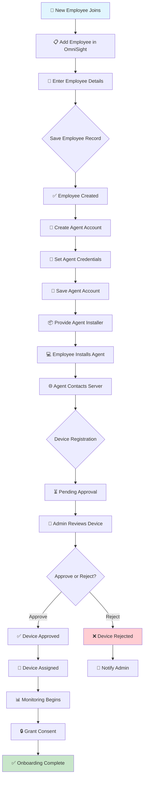

## Swimlane Diagram

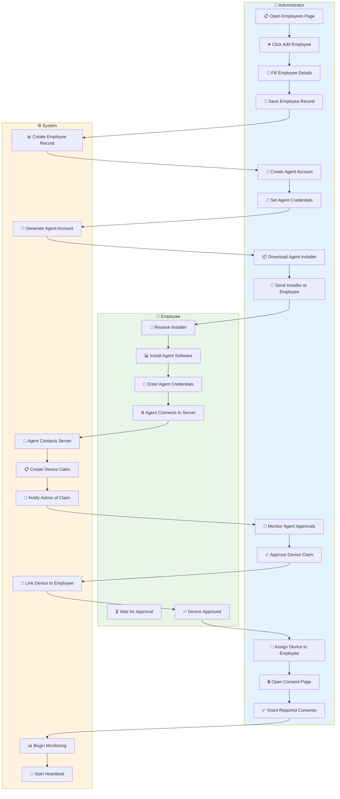

## Step-by-Step Procedure

| Step | Actor | Action | Result |
|------|-------|--------|--------|
| 1 | Administrator | Open Employees page | Ready to add |
| 2 | Administrator | Click Add Employee | Form opens |
| 3 | Administrator | Fill in details | Data entered |
| 4 | System | Create record | Employee created |
| 5 | Administrator | Create agent account | Credentials set |
| 6 | System | Generate account | Account ready |
| 7 | Administrator | Provide installer | Installer ready |
| 8 | Employee | Install agent | Agent installed |
| 9 | Employee | Enter credentials | Agent authenticated |
| 10 | System | Create device claim | Claim pending |
| 11 | Administrator | Approve device | Device authorized |
| 12 | Administrator | Grant consent | Monitoring allowed |
| 13 | System | Start monitoring | Data collection begins |

## Checklist

- [ ] Employee record created
- [ ] Agent account created
- [ ] Installer provided to employee
- [ ] Agent installed on device
- [ ] Device claim approved
- [ ] Consent granted
- [ ] Monitoring verified

---

# 4. Scenario 2: New Device Enrollment

## What is it?

The process of enrolling a new company-owned device into the monitoring system.

## Flowchart

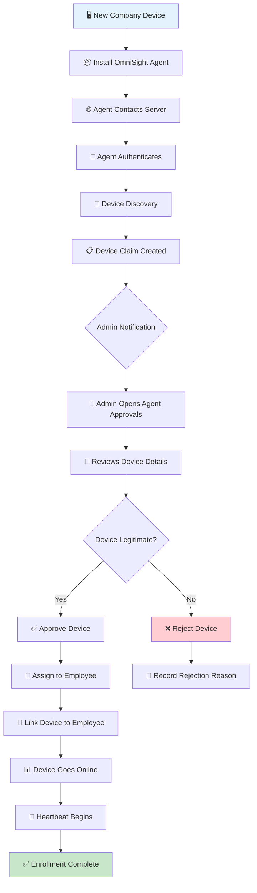

## Swimlane Diagram

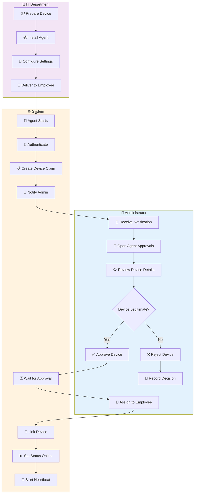

## Device Lifecycle States

```
┌──────────────────────────────────────────────────────────────────────┐
│                         DEVICE LIFECYCLE                             │
├──────────────────────────────────────────────────────────────────────┤
│                                                                      │
│  ┌─────────┐    ┌─────────┐    ┌─────────┐    ┌─────────┐         │
│  │ PENDING │ ──▶│APPROVED │ ──▶│ ONLINE  │ ──▶│ ACTIVE  │         │
│  │         │    │         │    │         │    │MONITORING│         │
│  └─────────┘    └─────────┘    └─────────┘    └─────────┘         │
│       │              │              │              │                 │
│       ▼              ▼              ▼              ▼                 │
│  ┌─────────┐    ┌─────────┐    ┌─────────┐    ┌─────────┐         │
│  │REJECTED │    │INACTIVE │    │OFFLINE  │    │ RETIRED │         │
│  │         │    │         │    │         │    │         │         │
│  └─────────┘    └─────────┘    └─────────┘    └─────────┘         │
│                                                                      │
└──────────────────────────────────────────────────────────────────────┘
```

## Checklist

- [ ] Agent installed on device
- [ ] Device registered with server
- [ ] Admin notified of new claim
- [ ] Device details reviewed
- [ ] Device approved/rejected
- [ ] Device assigned to employee
- [ ] Device status verified online

---

# 5. Scenario 3: Device Offline Investigation

## What is it?

The process of investigating and resolving an offline device issue.

## Flowchart

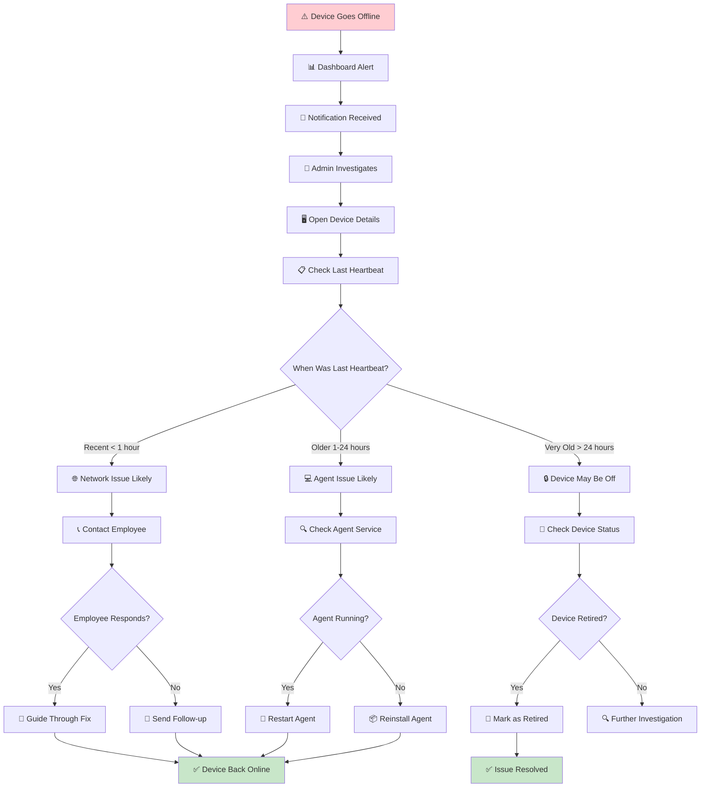

## Swimlane Diagram

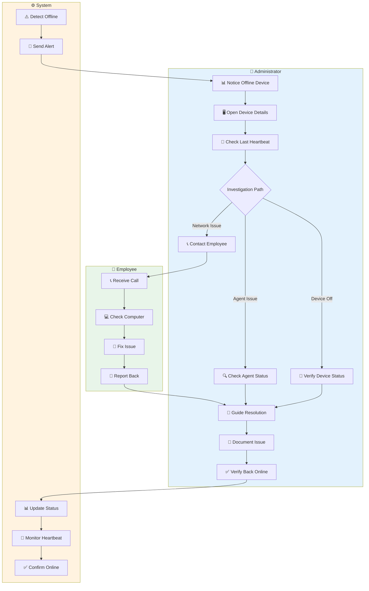

## Investigation Checklist

- [ ] Check device status and last heartbeat
- [ ] Determine likely cause (network/agent/device)
- [ ] Contact employee if needed
- [ ] Guide through resolution
- [ ] Verify device returns online
- [ ] Document the issue

---

# 6. Scenario 4: Employee Activity Review

## What is it?

The process of reviewing employee productivity and activity.

## Flowchart

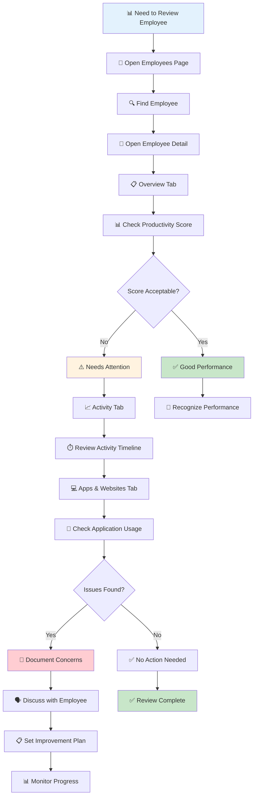

## Swimlane Diagram

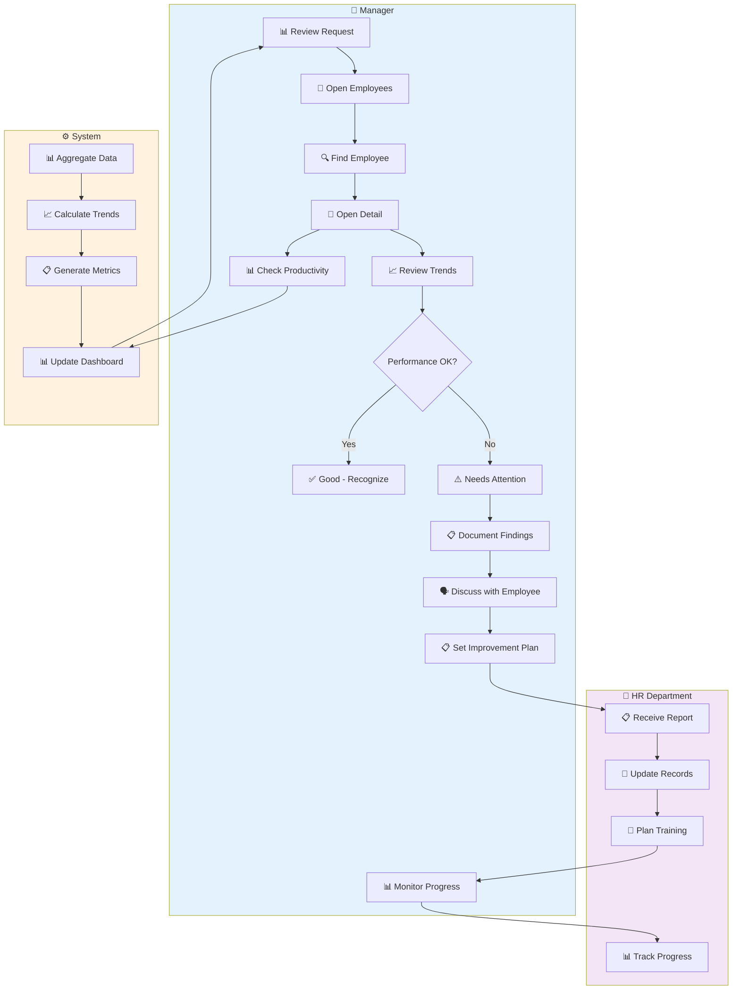

## Activity Review Checklist

- [ ] Check productivity score trend
- [ ] Review most used applications
- [ ] Check work hours and breaks
- [ ] Verify activity categories
- [ ] Note any anomalies
- [ ] Compare with team average
- [ ] Document findings

---

# 7. Scenario 5: Management Review Meeting

## What is it?

Preparing for and conducting a management review meeting.

## Flowchart

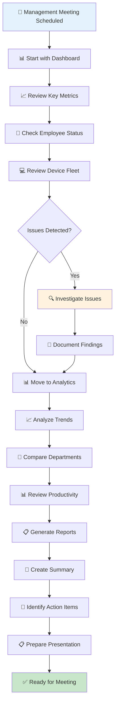

## Swimlane Diagram

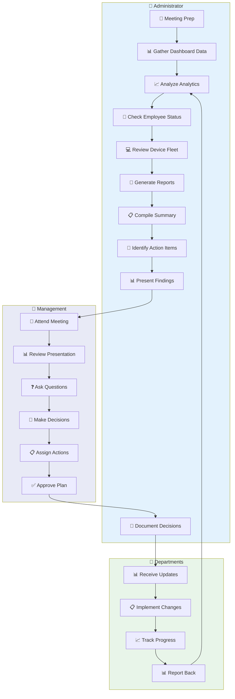

## Meeting Preparation Checklist

- [ ] Dashboard metrics (last 7 days)
- [ ] Productivity trends (monthly)
- [ ] Department comparisons
- [ ] Device fleet status
- [ ] Security alerts summary
- [ ] Anomaly detection results
- [ ] Action items from previous meeting

---

# 8. Scenario 6: Security Alert Response

## What is it?

Responding to security-related alerts and incidents.

## Flowchart

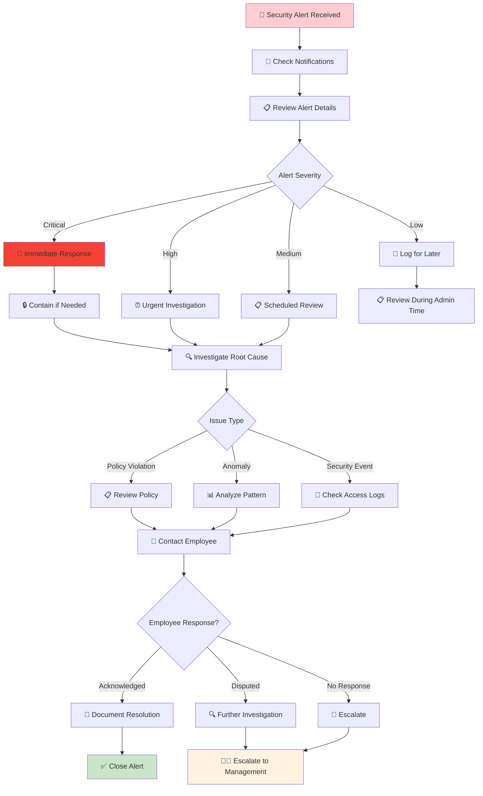

## Swimlane Diagram

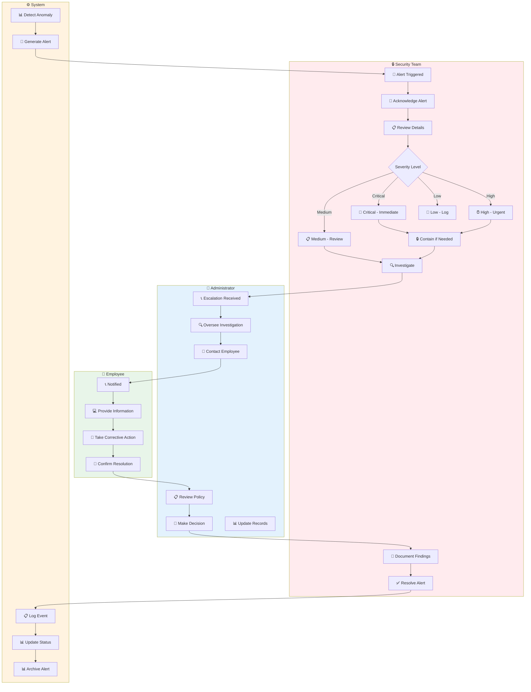

## Security Response Matrix

| Severity | Response Time | Actions | Escalation |
|----------|---------------|---------|------------|
| **Critical** | Immediate | Contain, Investigate, Resolve | Management |
| **High** | Within 1 hour | Investigate, Resolve | Admin |
| **Medium** | Within 4 hours | Review, Document | Team Lead |
| **Low** | Within 24 hours | Log, Monitor | None |

## Security Response Checklist

- [ ] Acknowledge alert immediately
- [ ] Review alert details and severity
- [ ] Check affected employee/device
- [ ] Investigate root cause
- [ ] Take containment action if needed
- [ ] Document findings
- [ ] Update alert status
- [ ] Follow up with employee
- [ ] Report to management if critical

---

# 9. Scenario 7: Consent Management

## What is it?

Managing employee monitoring consent and policies.

## Flowchart

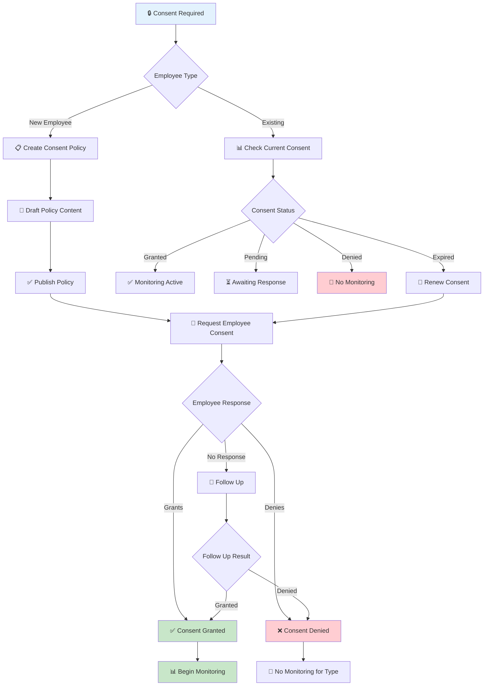

## Swimlane Diagram

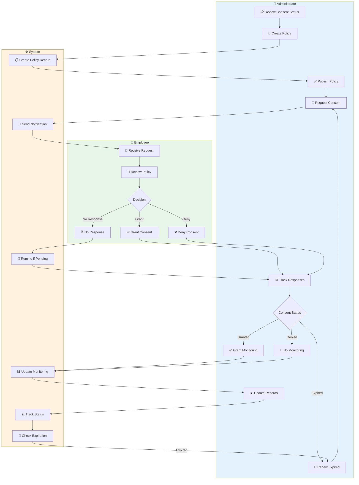

## Consent Types Matrix

| Consent Type | What It Governs | Required | Default |
|--------------|-----------------|----------|---------|
| **Monitoring** | General monitoring | Yes | Required |
| **Screenshot** | Screen capture | Yes | Required |
| **Activity Tracking** | App/website usage | Yes | Required |
| **Keystroke** | Keyboard statistics | Optional | Disabled |
| **USB Monitoring** | USB device tracking | Optional | Disabled |
| **Location** | GPS tracking | Optional | Disabled |
| **Webcam Access** | Webcam relay | Optional | Disabled |

---

# 10. Scenario 8: Report Generation

## What is it?

Creating and distributing workforce reports.

## Flowchart

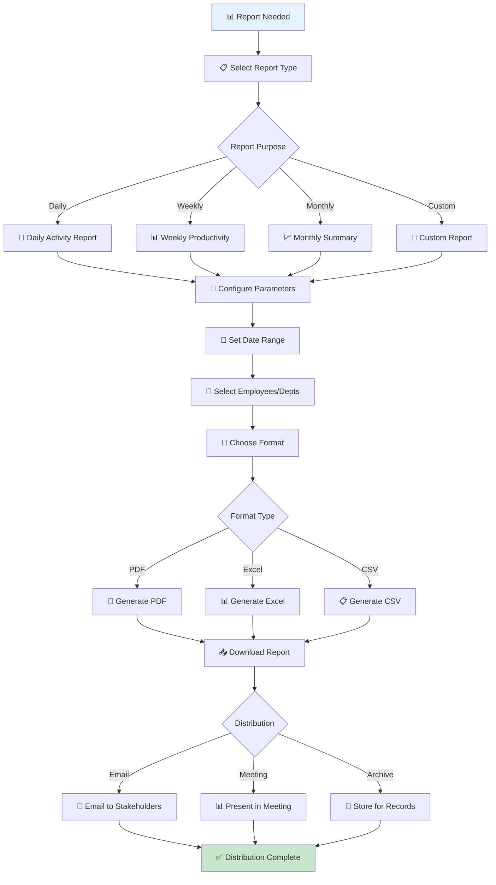

## Swimlane Diagram

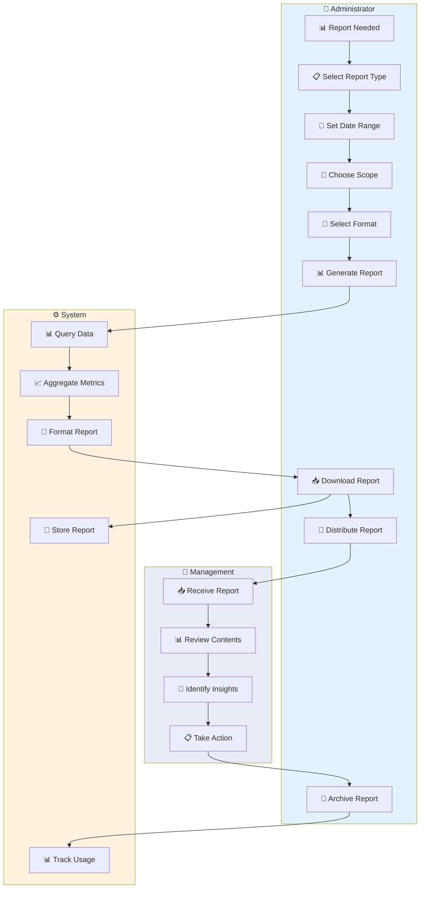

## Report Types & Formats

| Report Type | Best Format | Frequency | Audience |
|-------------|-------------|-----------|----------|
| **Daily Activity** | PDF | Daily | Managers |
| **Weekly Productivity** | PDF/Excel | Weekly | Management |
| **Monthly Summary** | PDF | Monthly | Executives |
| **Device Status** | Excel | Weekly | IT Admin |
| **Compliance** | PDF | Monthly | Compliance |
| **Custom** | CSV/Excel | As needed | Various |

---

# 11. RACI Matrix

## Complete Responsibility Assignment

| Activity | Administrator | Employee | System | Management |
|----------|---------------|----------|--------|------------|
| Add Employee | **R** | I | C | I |
| Install Agent | C | **R** | C | I |
| Approve Device | **R** | I | C | I |
| Grant Consent | C | **R** | C | I |
| Monitor Activity | **R** | I | **R** | I |
| Investigate Alert | **R** | C | C | I |
| Generate Report | **R** | I | **R** | I |
| Make Decisions | C | I | I | **R** |

**Legend:**
- **R** = Responsible (does the work)
- **A** = Accountable (owns the outcome)
- **C** = Consulted (provides input)
- **I** = Informed (kept updated)

---

# 12. Quick Reference Checklists

## Daily Tasks

```
┌─────────────────────────────────────────────────────────────┐
│  📋 DAILY ADMINISTRATOR CHECKLIST                           │
├─────────────────────────────────────────────────────────────┤
│  □ Check Dashboard for alerts                               │
│  □ Review offline devices                                   │
│  □ Check Agent Approvals queue                              │
│  □ Review critical notifications                            │
│  □ Monitor live activity if needed                          │
└─────────────────────────────────────────────────────────────┘
```

## Weekly Tasks

```
┌─────────────────────────────────────────────────────────────┐
│  📊 WEEKLY ADMINISTRATOR CHECKLIST                          │
├─────────────────────────────────────────────────────────────┤
│  □ Review Analytics trends                                  │
│  □ Generate weekly productivity report                      │
│  □ Check consent compliance                                 │
│  □ Review audit logs                                        │
│  □ Update device assignments if needed                      │
│  □ Address any anomalies                                    │
└─────────────────────────────────────────────────────────────┘
```

## Monthly Tasks

```
┌─────────────────────────────────────────────────────────────┐
│  📈 MONTHLY ADMINISTRATOR CHECKLIST                         │
├─────────────────────────────────────────────────────────────┤
│  □ Review data retention settings                           │
│  □ Analyze department performance                           │
│  □ Update application policies                              │
│  □ Review and resolve anomalies                             │
│  □ Generate monthly summary report                          │
│  □ Conduct management review meeting                        │
│  □ Update consent policies if needed                        │
└─────────────────────────────────────────────────────────────┘
```

---

# 13. Device Lifecycle States

## State Transitions

```
┌──────────────────────────────────────────────────────────────────────┐
│                         DEVICE LIFECYCLE                             │
├──────────────────────────────────────────────────────────────────────┤
│                                                                      │
│  ┌─────────┐    ┌─────────┐    ┌─────────┐    ┌─────────┐         │
│  │ PENDING │ ──▶│APPROVED │ ──▶│ ONLINE  │ ──▶│ ACTIVE  │         │
│  │         │    │         │    │         │    │MONITORING│         │
│  └─────────┘    └─────────┘    └─────────┘    └─────────┘         │
│       │              │              │              │                 │
│       ▼              ▼              ▼              ▼                 │
│  ┌─────────┐    ┌─────────┐    ┌─────────┐    ┌─────────┐         │
│  │REJECTED │    │INACTIVE │    │OFFLINE  │    │ RETIRED │         │
│  │         │    │         │    │         │    │         │         │
│  └─────────┘    └─────────┘    └─────────┘    └─────────┘         │
│                                                                      │
└──────────────────────────────────────────────────────────────────────┘
```

## State Descriptions

| State | Description | Transitions To |
|-------|-------------|----------------|
| **PENDING** | Device registered, awaiting approval | APPROVED or REJECTED |
| **APPROVED** | Approved by admin, assigned to employee | ONLINE or INACTIVE |
| **ONLINE** | Active, sending telemetry | ACTIVE or OFFLINE |
| **ACTIVE** | Fully monitoring, collecting data | OFFLINE or RETIRED |
| **REJECTED** | Denied by admin | Terminal state |
| **INACTIVE** | Deauthorized or employee archived | Terminal state |
| **OFFLINE** | No recent communication | ONLINE or RETIRED |
| **RETIRED** | No longer in use | Terminal state |

---

# 14. Decision Trees

## Device Offline Investigation Decision Tree

```
                    ┌─────────────────┐
                    │ Device Offline  │
                    └────────┬────────┘
                             │
                    ┌────────▼────────┐
                    │ Check Last      │
                    │ Heartbeat       │
                    └────────┬────────┘
                             │
            ┌────────────────┼────────────────┐
            │                │                │
    ┌───────▼───────┐ ┌─────▼─────┐ ┌───────▼───────┐
    │ Recent (<1hr) │ │ 1-24 hrs  │ │ Very Old (>24)│
    └───────┬───────┘ └─────┬─────┘ └───────┬───────┘
            │                │                │
    ┌───────▼───────┐ ┌─────▼─────┐ ┌───────▼───────┐
    │ Network Issue │ │Agent Issue│ │ Device Off    │
    └───────┬───────┘ └─────┬─────┘ └───────┬───────┘
            │                │                │
    ┌───────▼───────┐ ┌─────▼─────┐ ┌───────▼───────┐
    │ Contact       │ │ Check     │ │ Verify Status │
    │ Employee      │ │ Service   │ │               │
    └───────────────┘ └───────────┘ └───────────────┘
```

## Security Alert Severity Decision Tree

```
                    ┌─────────────────┐
                    │ Security Alert  │
                    └────────┬────────┘
                             │
                    ┌────────▼────────┐
                    │ Assess Severity │
                    └────────┬────────┘
                             │
        ┌────────────────────┼────────────────────┐
        │                    │                    │
┌───────▼───────┐    ┌──────▼──────┐    ┌───────▼───────┐
│   Critical    │    │    High     │    │    Medium     │
└───────┬───────┘    └──────┬──────┘    └───────┬───────┘
        │                    │                    │
┌───────▼───────┐    ┌──────▼──────┐    ┌───────▼───────┐
│ Immediate     │    │ Within 1 hr │    │ Within 4 hrs  │
│ Response      │    │             │    │               │
└───────┬───────┘    └──────┬──────┘    └───────┬───────┘
        │                    │                    │
┌───────▼───────┐    ┌──────▼──────┐    ┌───────▼───────┐
│ Contain +     │    │ Investigate │    │ Review +      │
│ Investigate   │    │ + Resolve   │    │ Document      │
└───────────────┘    └─────────────┘    └───────────────┘
```

---

# Document Verification

## Quality Checklist

- [x] All 8 scenarios documented
- [x] Flowcharts included for each scenario
- [x] Swimlane diagrams with actor responsibilities
- [x] RACI matrix for responsibility assignment
- [x] Quick reference checklists
- [x] Device lifecycle states documented
- [x] Decision trees for common issues
- [x] No sensitive credentials included
- [x] All workflows verified against actual product

## Document Statistics

| Metric | Count |
|--------|-------|
| Total Scenarios | 8 |
| Flowcharts | 8 |
| Swimlane Diagrams | 8 |
| RACI Tables | 2 |
| Checklists | 3 |
| Decision Trees | 2 |
| Actor Types | 5 |

---

*Complete Workflow Guide created August 2026*
*OmniSight v1.0.0*
*For Organization Administrators*
