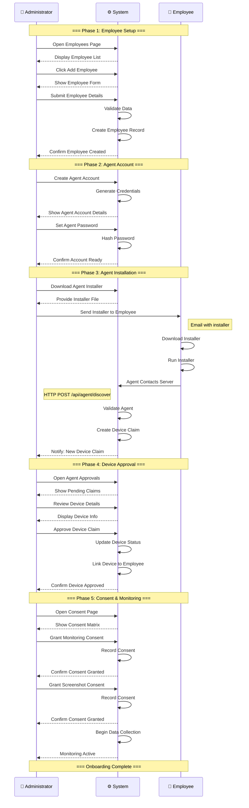
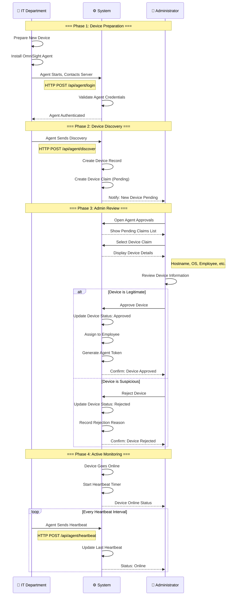
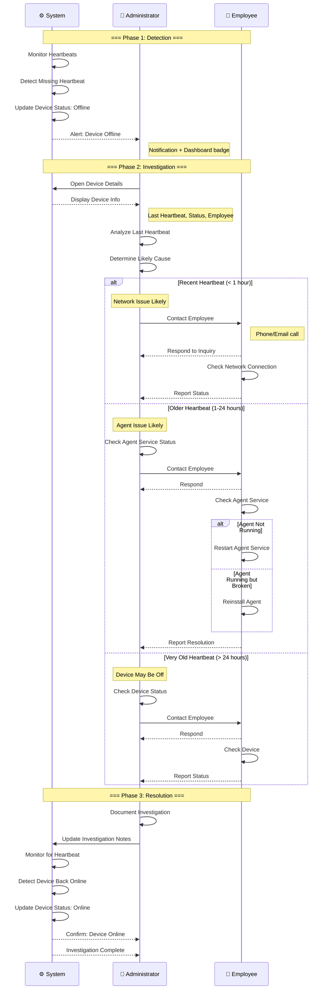
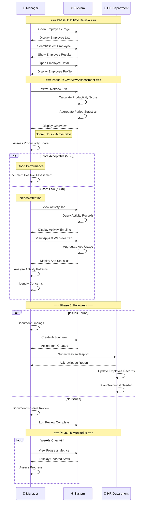
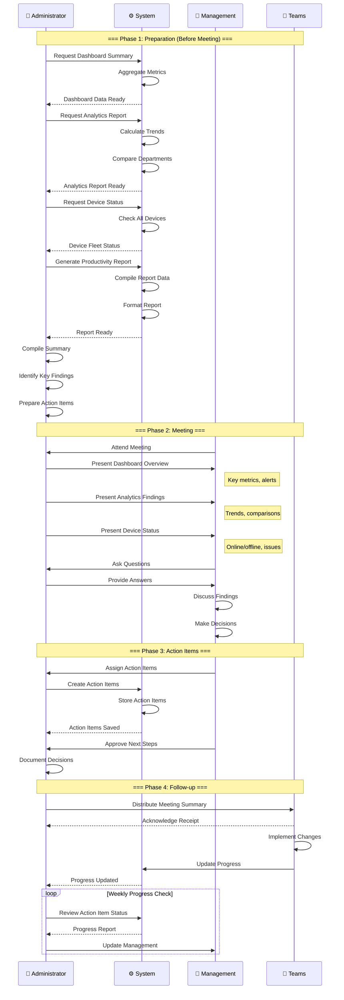
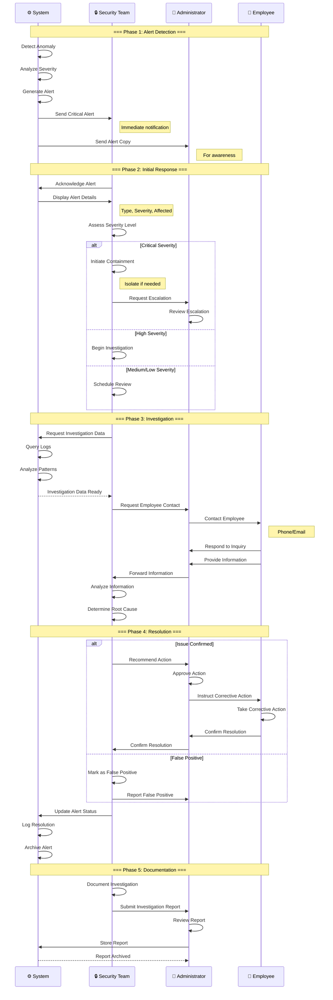
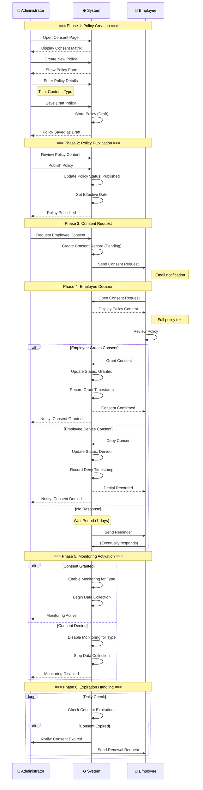
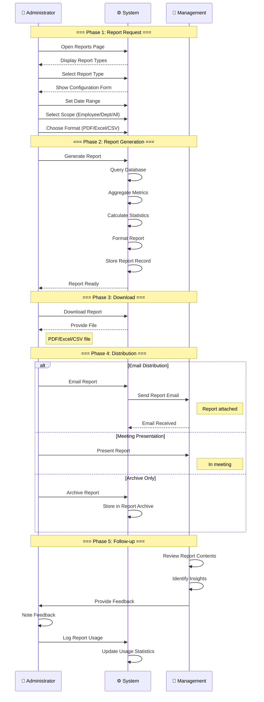

# OmniSight — Sequence Diagrams

## Message Flows Between Actors

This document shows detailed sequence diagrams that illustrate the **order of messages and interactions** between actors in each workflow. Sequence diagrams are ideal for understanding:

- The exact order of operations
- Which actor initiates each action
- What responses are expected
- Synchronization points between actors

---

## Sequence Diagram Legend

| Symbol | Meaning |
|--------|---------|
| **→** | Synchronous message (caller waits) |
| **-->>** | Asynchronous message (caller doesn't wait) |
| **Note** | Information about the interaction |
| **alt** | Alternative paths (if/else) |
| **loop** | Repeated interactions |
| **opt** | Optional interactions |
| **par** | Parallel interactions |

---

## Scenario 1: New Employee Onboarding — Sequence



---

## Scenario 2: Device Enrollment — Sequence



---

## Scenario 3: Device Offline Investigation — Sequence



---

## Scenario 4: Employee Activity Review — Sequence



---

## Scenario 5: Management Review Meeting — Sequence



---

## Scenario 6: Security Alert Response — Sequence



---

## Scenario 7: Consent Management — Sequence



---

## Scenario 8: Report Generation — Sequence



---

## Cross-Scenario Message Flow Summary

### Administrator ↔ System Messages

| Message | Direction | Description |
|---------|-----------|-------------|
| Open Page | A → S | Request page load |
| Submit Form | A → S | Send form data |
| Approve/Reject | A → S | Decision action |
| Grant Consent | A → S | Consent action |
| Generate Report | A → S | Report request |
| Download File | A → S | File request |

### System → Administrator Messages

| Message | Direction | Description |
|---------|-----------|-------------|
| Display Data | S → A | Show requested data |
| Confirm Action | S → A | Action completed |
| Send Alert | S → A | Important notification |
| Report Ready | S → A | Report generated |

### Employee ↔ System Messages

| Message | Direction | Description |
|---------|-----------|-------------|
| Agent Contact | E → S | Agent connects to server |
| Heartbeat | E → S | Regular status update |
| Grant/Deny Consent | E → S | Consent decision |
| Receive Notification | S → E | System notification |

### Administrator ↔ Employee Messages

| Message | Direction | Description |
|---------|-----------|-------------|
| Send Installer | A → E | Provide software |
| Contact Employee | A → E | Reach out for info |
| Provide Info | E → A | Respond to inquiry |
| Confirm Resolution | E → A | Issue resolved |

---

## Timing Diagrams (Simplified)

### Device Enrollment Timing

```
Time ──────────────────────────────────────────────────────▶

IT:      [Prepare] [Install] [Deliver] ─────────────────────
         │         │         │
         ▼         ▼         ▼
System:  ─────────[Auth]──[Claim]──[Notify]──[Online]───────
                              │       │         │
                              ▼       ▼         ▼
Admin:   ───────────────────[Review]─[Approve]─[Monitor]────
```

### Security Alert Timing

```
Time ──────────────────────────────────────────────────────▶

System:  [Detect]─[Alert]───────────────────────────────────
         │        │
         ▼        ▼
Security:────────[Acknowledge]─[Investigate]─[Resolve]──────
                        │            │            │
                        ▼            ▼            ▼
Admin:   ────────────[Escalate]──[Oversee]──[Document]──────
                              │            │
                              ▼            ▼
Employee:────────────────────[Contact]──[Resolve]────────────
```

---

*Sequence diagrams created August 2026*
*OmniSight v1.0.0*
