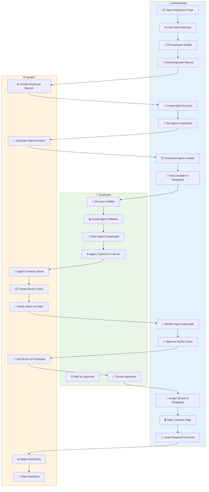
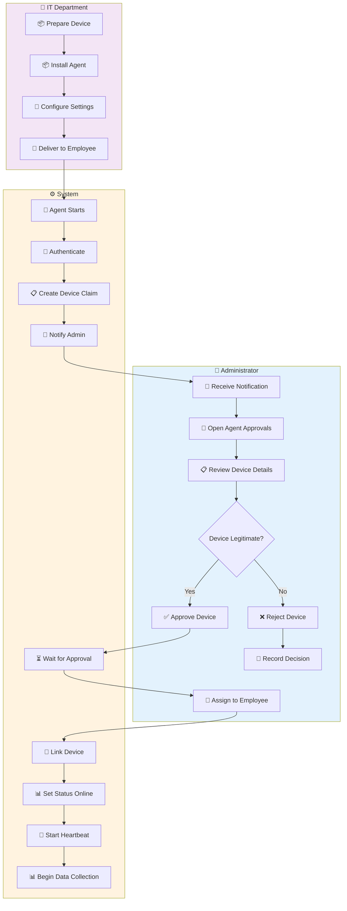
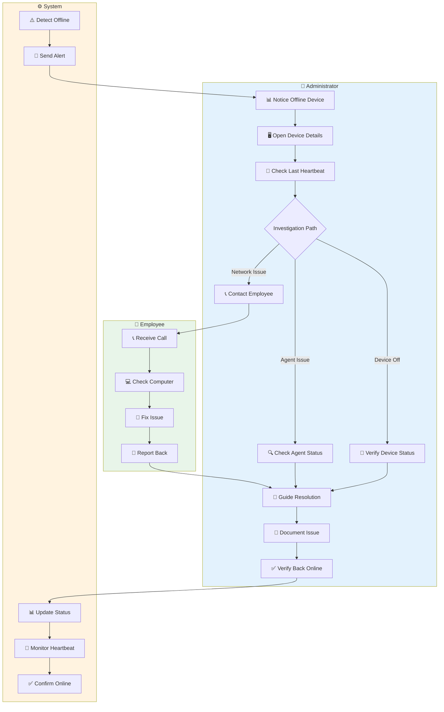
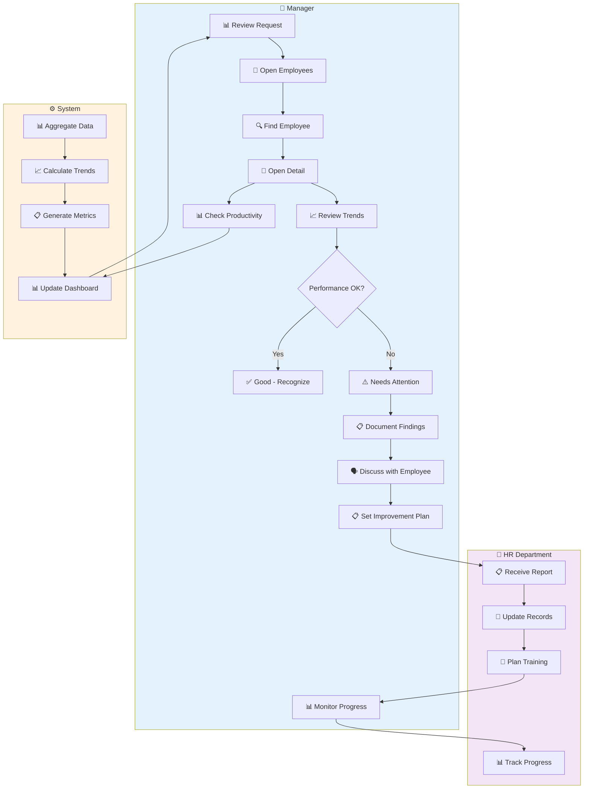
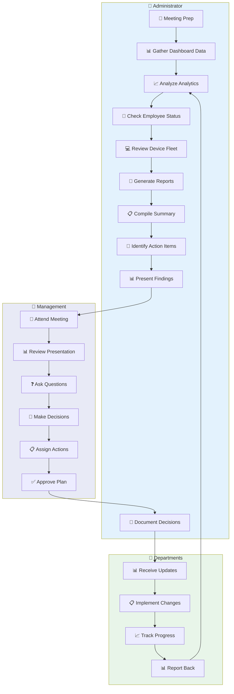
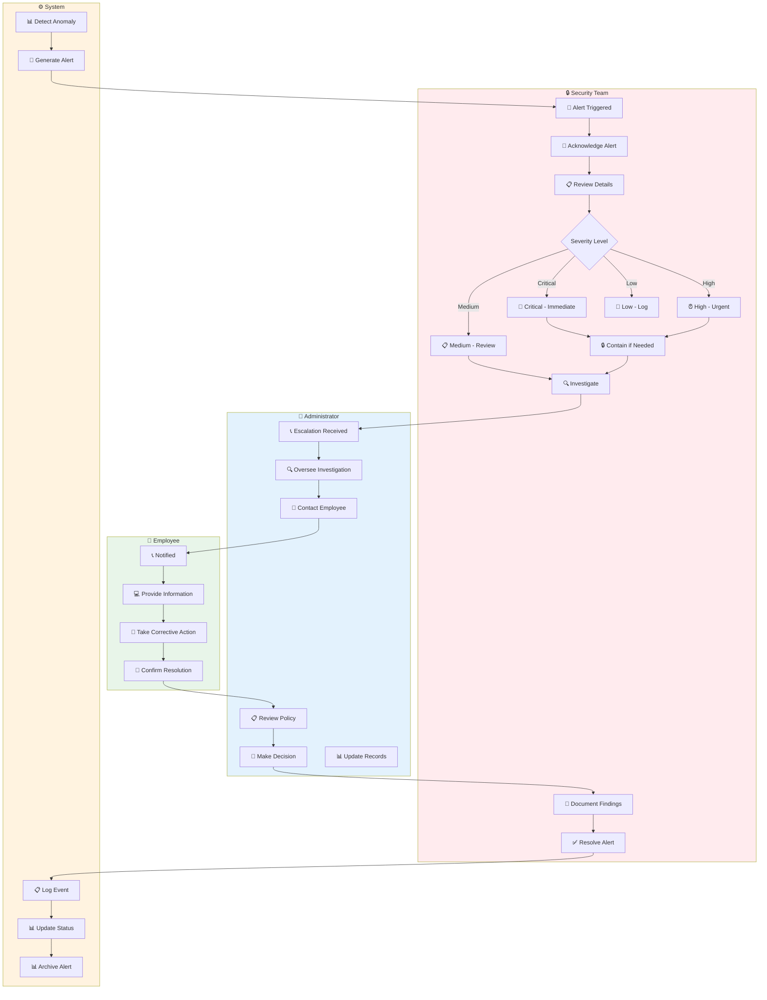
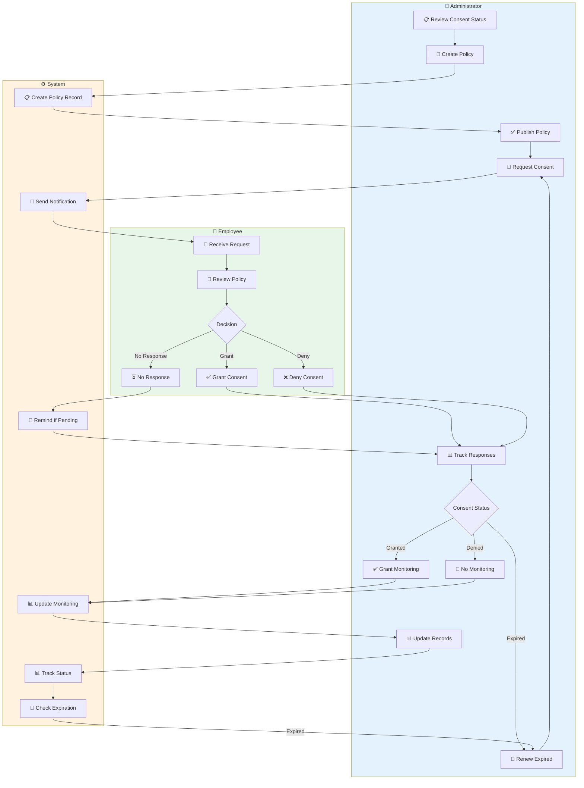
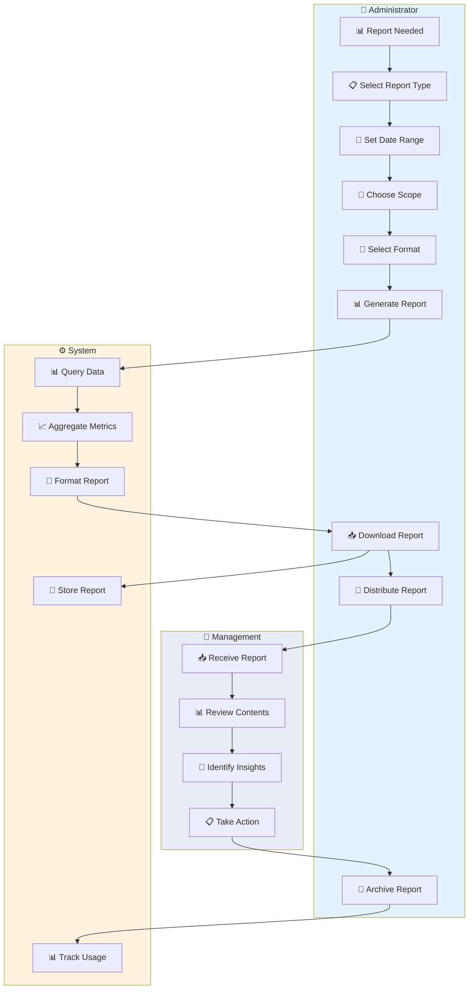

# OmniSight — Swimlane Diagrams

## Actor Responsibilities in Workflows

This document shows detailed swimlane diagrams that clearly define **who does what** in each workflow. Each swimlane represents a different actor (Administrator, Employee, System, etc.).

---

## Scenario 1: New Employee Onboarding — Swimlane



### Responsibility Matrix

| Step | Administrator | Employee | System |
|------|---------------|----------|--------|
| 1 | Add employee record | — | Create database record |
| 2 | Create agent account | — | Generate credentials |
| 3 | Provide installer | Install agent | — |
| 4 | — | Enter credentials | Validate & connect |
| 5 | — | — | Create device claim |
| 6 | Approve device | — | Link device to employee |
| 7 | Grant consent | — | Begin monitoring |

---

## Scenario 2: Device Enrollment — Swimlane



### Device Lifecycle States

```
┌──────────────────────────────────────────────────────────────────────┐
│                         DEVICE LIFECYCLE                             │
├──────────────────────────────────────────────────────────────────────┤
│                                                                      │
│  ┌─────────┐    ┌─────────┐    ┌─────────┐    ┌─────────┐         │
│  │ PENDING │ ──▶│APPROVED │ ──▶│ ONLINE  │ ──▶│ACTIVE   │         │
│  │         │    │         │    │         │    │MONITORING│         │
│  └─────────┘    └─────────┘    └─────────┘    └─────────┘         │
│       │              │              │              │                 │
│       ▼              ▼              ▼              ▼                 │
│  ┌─────────┐    ┌─────────┐    ┌─────────┐    ┌─────────┐         │
│  │REJECTED │    │INACTIVE │    │OFFLINE  │    │ RETIRED │         │
│  │         │    │         │    │         │    │         │         │
│  └─────────┘    └─────────┘    └─────────┘    └─────────┘         │
│                                                                      │
└──────────────────────────────────────────────────────────────────────┘
```

---

## Scenario 3: Device Offline Investigation — Swimlane



### Investigation Decision Tree

```
                    ┌─────────────────┐
                    │ Device Offline  │
                    └────────┬────────┘
                             │
                    ┌────────▼────────┐
                    │ Check Last      │
                    │ Heartbeat       │
                    └────────┬────────┘
                             │
            ┌────────────────┼────────────────┐
            │                │                │
    ┌───────▼───────┐ ┌─────▼─────┐ ┌───────▼───────┐
    │ Recent (<1hr) │ │ 1-24 hrs  │ │ Very Old (>24)│
    └───────┬───────┘ └─────┬─────┘ └───────┬───────┘
            │                │                │
    ┌───────▼───────┐ ┌─────▼─────┐ ┌───────▼───────┐
    │ Network Issue │ │Agent Issue│ │ Device Off    │
    └───────┬───────┘ └─────┬─────┘ └───────┬───────┘
            │                │                │
    ┌───────▼───────┐ ┌─────▼─────┐ ┌───────▼───────┐
    │ Contact       │ │ Check     │ │ Verify Status │
    │ Employee      │ │ Service   │ │               │
    └───────────────┘ └───────────┘ └───────────────┘
```

---

## Scenario 4: Employee Activity Review — Swimlane



### Activity Review Checklist

| Review Area | What to Check | Red Flags |
|-------------|---------------|-----------|
| **Productivity Score** | Overall rating (0-100) | Score < 50 consistently |
| **Work Hours** | Daily/weekly hours | Consistent overtime or underwork |
| **App Usage** | Most used applications | High unproductive time |
| **Break Patterns** | Break frequency/duration | Excessive or no breaks |
| **Activity Timeline** | Daily activity flow | Long idle periods |

---

## Scenario 5: Management Review Meeting — Swimlane



### Meeting Agenda Template

```
┌─────────────────────────────────────────────────────────────┐
│  📋 MANAGEMENT REVIEW MEETING AGENDA                        │
├─────────────────────────────────────────────────────────────┤
│                                                             │
│  1. Dashboard Overview (5 min)                              │
│     • Key metrics summary                                   │
│     • Alert status                                          │
│                                                             │
│  2. Productivity Analysis (10 min)                          │
│     • Trends and patterns                                   │
│     • Department comparisons                                │
│                                                             │
│  3. Device Fleet Status (5 min)                             │
│     • Online/offline status                                 │
│     • Any issues                                            │
│                                                             │
│  4. Security & Compliance (5 min)                           │
│     • Anomalies detected                                    │
│     • Policy violations                                     │
│                                                             │
│  5. Action Items (5 min)                                    │
│     • Review previous actions                               │
│     • New assignments                                       │
│                                                             │
└─────────────────────────────────────────────────────────────┘
```

---

## Scenario 6: Security Alert Response — Swimlane



### Security Response Matrix

| Severity | Response Time | Actions | Escalation |
|----------|---------------|---------|------------|
| **Critical** | Immediate | Contain, Investigate, Resolve | Management |
| **High** | Within 1 hour | Investigate, Resolve | Admin |
| **Medium** | Within 4 hours | Review, Document | Team Lead |
| **Low** | Within 24 hours | Log, Monitor | None |

---

## Scenario 7: Consent Management — Swimlane



### Consent Types Matrix

| Consent Type | What It Governs | Required | Default |
|--------------|-----------------|----------|---------|
| **Monitoring** | General monitoring | Yes | Required |
| **Screenshot** | Screen capture | Yes | Required |
| **Activity Tracking** | App/website usage | Yes | Required |
| **Keystroke** | Keyboard statistics | Optional | Disabled |
| **USB Monitoring** | USB device tracking | Optional | Disabled |
| **Location** | GPS tracking | Optional | Disabled |
| **Webcam Access** | Webcam relay | Optional | Disabled |

---

## Scenario 8: Report Generation — Swimlane



### Report Types & Formats

| Report Type | Best Format | Frequency | Audience |
|-------------|-------------|-----------|----------|
| **Daily Activity** | PDF | Daily | Managers |
| **Weekly Productivity** | PDF/Excel | Weekly | Management |
| **Monthly Summary** | PDF | Monthly | Executives |
| **Device Status** | Excel | Weekly | IT Admin |
| **Compliance** | PDF | Monthly | Compliance |
| **Custom** | CSV/Excel | As needed | Various |

---

## Actor Responsibility Summary

### Administrator Responsibilities

| Area | Responsibilities |
|------|------------------|
| **Employees** | Add, edit, archive, monitor |
| **Devices** | Approve, assign, troubleshoot |
| **Consent** | Create policies, grant/revoke |
| **Security** | Respond to alerts, investigate |
| **Reports** | Generate, distribute, archive |
| **Settings** | Configure system options |

### Employee Responsibilities

| Area | Responsibilities |
|------|------------------|
| **Agent** | Install, maintain, troubleshoot |
| **Consent** | Review policies, grant/deny |
| **Compliance** | Follow policies, report issues |
| **Communication** | Respond to admin inquiries |

### System Responsibilities

| Area | Responsibilities |
|------|------------------|
| **Data Collection** | Gather telemetry, screenshots |
| **Alerts** | Detect anomalies, notify |
| **Storage** | Store data per retention rules |
| **Security** | Enforce access controls |
| **Automation** | Run background jobs |

---

## RACI Matrix

| Activity | Administrator | Employee | System | Management |
|----------|---------------|----------|--------|------------|
| Add Employee | **R/A** | I | C | I |
| Install Agent | C | **R/A** | C | I |
| Approve Device | **R/A** | I | C | I |
| Grant Consent | C | **R/A** | C | I |
| Monitor Activity | **R/A** | I | **R** | I |
| Investigate Alert | **R/A** | C | C | I |
| Generate Report | **R/A** | I | **R** | I |
| Make Decisions | C | I | I | **R/A** |

**Legend:** R = Responsible, A = Accountable, C = Consulted, I = Informed

---

*Swimlane diagrams created August 2026*
*OmniSight v1.0.0*
