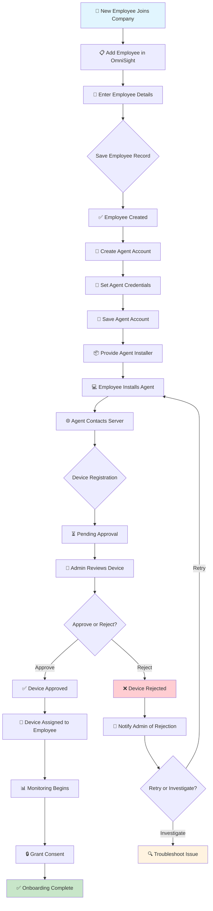
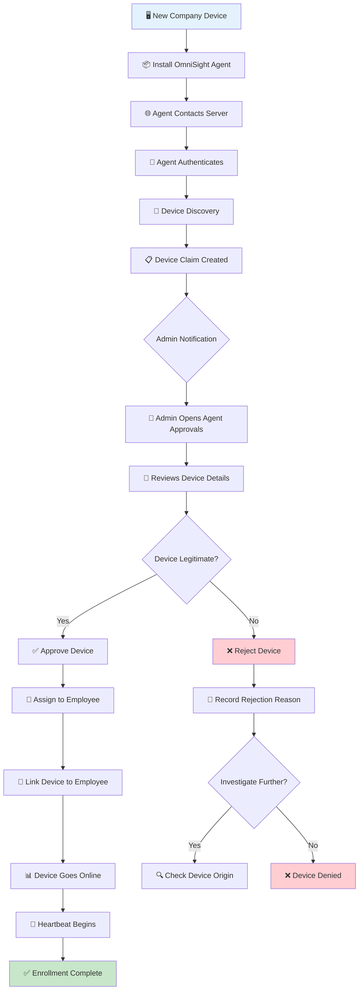
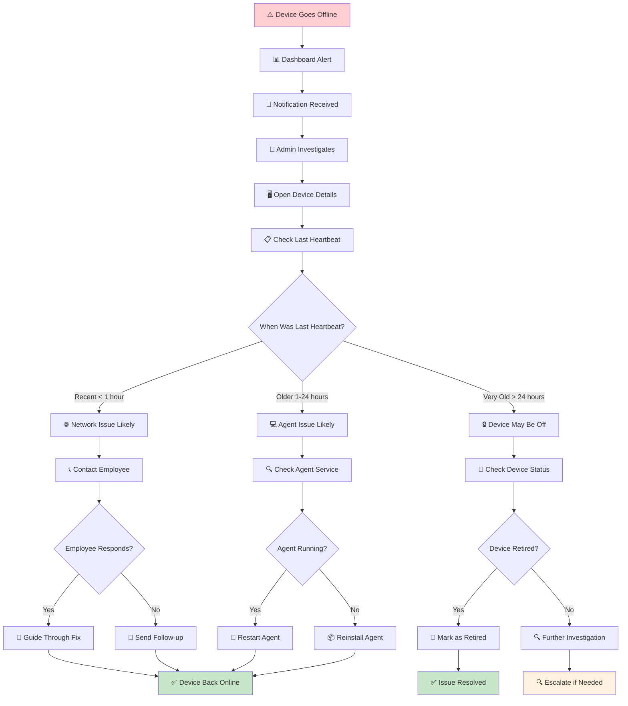
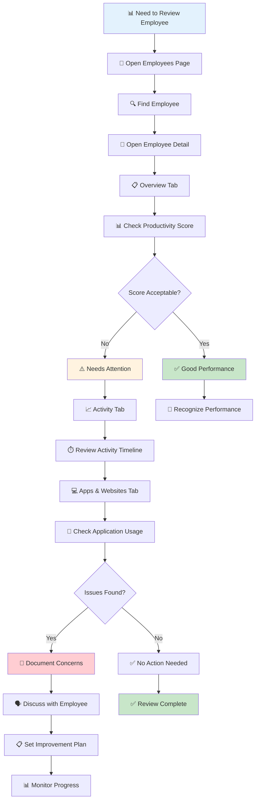
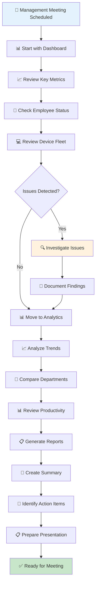
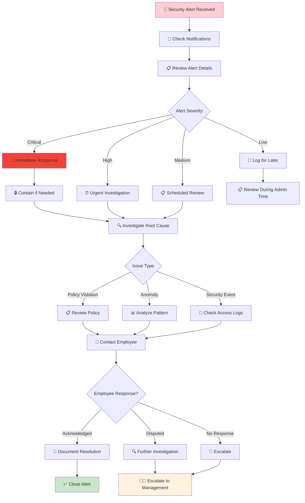
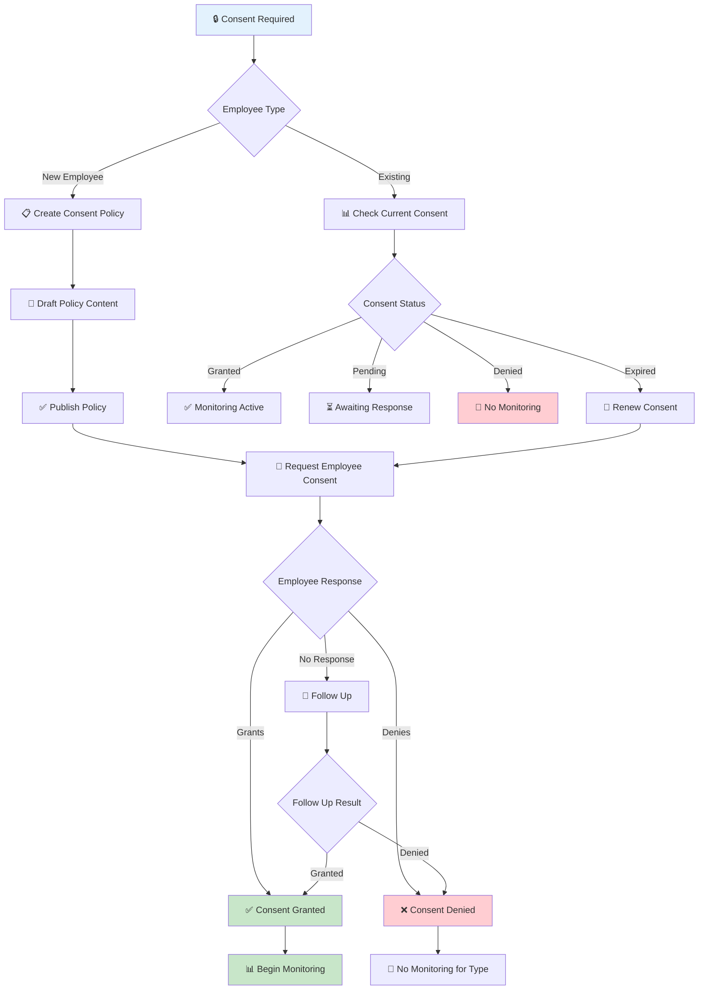
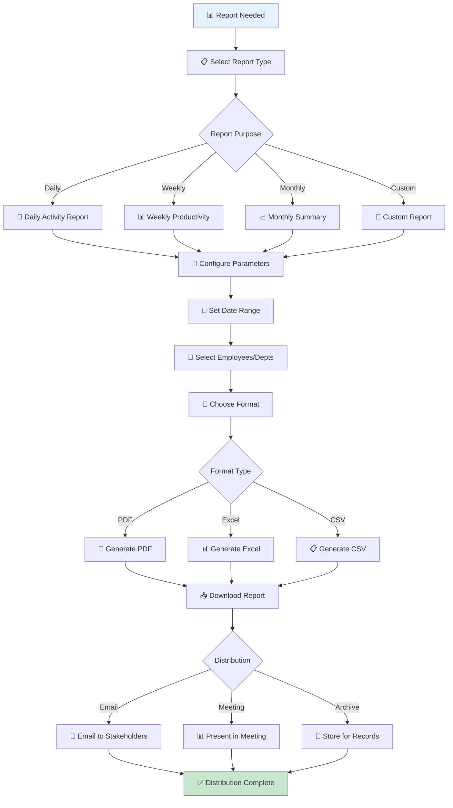
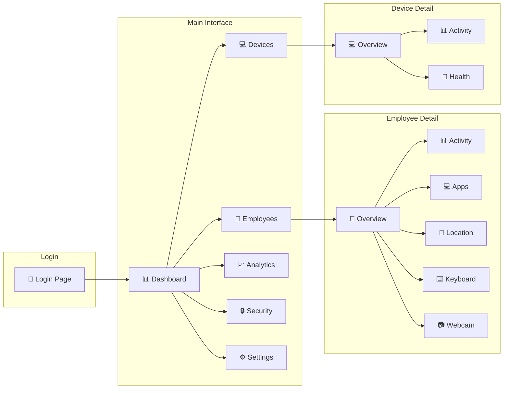

# OmniSight — Visual Workflow Diagrams

## Common Operational Scenarios

---

## Scenario 1: New Employee Onboarding

This workflow shows the complete process of onboarding a new employee into the OmniSight monitoring system.



### Steps Explained

| Step | Action | Who Does It | Result |
|------|--------|-------------|--------|
| 1 | Add Employee | Administrator | Employee record created |
| 2 | Create Agent Account | Administrator | Login credentials set |
| 3 | Install Agent | Employee | Agent software installed |
| 4 | Device Registration | System | Device appears in queue |
| 5 | Approve Device | Administrator | Device authorized |
| 6 | Grant Consent | Administrator | Monitoring permitted |
| 7 | Monitoring Begins | System | Data collection starts |

---

## Scenario 2: New Company Device Enrollment

This workflow shows how to enroll a new company-owned device.



### Device States During Enrollment

```
┌─────────────┐     ┌─────────────┐     ┌─────────────┐     ┌─────────────┐
│   PENDING   │ ──▶ │   APPROVED  │ ──▶ │   ONLINE    │ ──▶ │  MONITORING │
│   (New)     │     │  (Assigned) │     │  (Active)   │     │  (Collecting)│
└─────────────┘     └─────────────┘     └─────────────┘     └─────────────┘
       │                   │                   │
       ▼                   ▼                   ▼
┌─────────────┐     ┌─────────────┐     ┌─────────────┐
│  REJECTED   │     │  OFFLINE    │     │  INACTIVE   │
│  (Denied)   │     │  (No Signal)│     │ (Deauth'd)  │
└─────────────┘     └─────────────┘     └─────────────┘
```

---

## Scenario 3: Device Goes Offline Investigation

This workflow shows how to investigate and resolve an offline device.



### Investigation Checklist

- [ ] Check device status in Devices page
- [ ] Review last heartbeat timestamp
- [ ] Check if employee is on leave/break
- [ ] Verify network connectivity
- [ ] Check agent service status
- [ ] Contact employee if needed
- [ ] Document resolution

---

## Scenario 4: Employee Activity Review

This workflow shows how to review employee activity for management purposes.



### Activity Review Checklist

- [ ] Check productivity score trend
- [ ] Review most used applications
- [ ] Check work hours and breaks
- [ ] Verify activity categories
- [ ] Note any anomalies
- [ ] Compare with team average
- [ ] Document findings

---

## Scenario 5: Management Review Meeting

This workflow shows how to prepare for a management review meeting.



### Meeting Preparation Checklist

- [ ] Dashboard metrics (last 7 days)
- [ ] Productivity trends (monthly)
- [ ] Department comparisons
- [ ] Device fleet status
- [ ] Security alerts summary
- [ ] Anomaly detection results
- [ ] Action items from previous meeting

---

## Scenario 6: Security Alert Response

This workflow shows how to respond to security-related alerts.



### Security Response Checklist

- [ ] Acknowledge alert immediately
- [ ] Review alert details and severity
- [ ] Check affected employee/device
- [ ] Investigate root cause
- [ ] Take containment action if needed
- [ ] Document findings
- [ ] Update alert status
- [ ] Follow up with employee
- [ ] Report to management if critical

---

## Scenario 7: Consent Management Workflow

This workflow shows how to manage employee monitoring consent.



### Consent Types

| Type | What It Governs | Default |
|------|-----------------|---------|
| Monitoring | General monitoring | Required |
| Screenshot | Screen capture | Required |
| Activity Tracking | App/website usage | Required |
| Keystroke | Keyboard statistics | Optional |
| USB Monitoring | USB device tracking | Optional |
| Location | GPS tracking | Optional |
| Webcam Access | Webcam relay | Optional |

---

## Scenario 8: Report Generation and Distribution

This workflow shows how to generate and distribute workforce reports.



### Report Types Reference

| Report | Content | Frequency | Audience |
|--------|---------|-----------|----------|
| Daily Activity | Activity summary | Daily | Managers |
| Weekly Productivity | Productivity metrics | Weekly | Management |
| Monthly Summary | Comprehensive overview | Monthly | Executives |
| Device Status | Fleet health | Weekly | IT Admin |
| Compliance | Policy adherence | Monthly | Compliance |
| Custom | User-defined | As needed | Various |

---

## Quick Reference: Common Tasks

### Daily Tasks

```
┌─────────────────────────────────────────────────────────────┐
│  📋 DAILY ADMINISTRATOR CHECKLIST                           │
├─────────────────────────────────────────────────────────────┤
│  □ Check Dashboard for alerts                               │
│  □ Review offline devices                                   │
│  □ Check Agent Approvals queue                              │
│  □ Review critical notifications                            │
│  □ Monitor live activity if needed                          │
└─────────────────────────────────────────────────────────────┘
```

### Weekly Tasks

```
┌─────────────────────────────────────────────────────────────┐
│  📊 WEEKLY ADMINISTRATOR CHECKLIST                          │
├─────────────────────────────────────────────────────────────┤
│  □ Review Analytics trends                                  │
│  □ Generate weekly productivity report                      │
│  □ Check consent compliance                                 │
│  □ Review audit logs                                        │
│  □ Update device assignments if needed                      │
│  □ Address any anomalies                                    │
└─────────────────────────────────────────────────────────────┘
```

### Monthly Tasks

```
┌─────────────────────────────────────────────────────────────┐
│  📈 MONTHLY ADMINISTRATOR CHECKLIST                         │
├─────────────────────────────────────────────────────────────┤
│  □ Review data retention settings                           │
│  □ Analyze department performance                           │
│  □ Update application policies                              │
│  □ Review and resolve anomalies                             │
│  □ Generate monthly summary report                          │
│  □ Conduct management review meeting                        │
│  □ Update consent policies if needed                        │
└─────────────────────────────────────────────────────────────┘
```

---

## Navigation Flow Diagram



---

*Workflow diagrams created August 2026*
*OmniSight v1.0.0*
