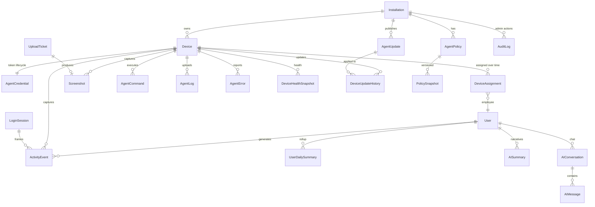

# WorkLensAI — Telemetry Database Design (Final)

> **File:** workload/18-Telemetry-Database-Design.md · **Version:** 1.0 · **Status:** Approved for implementation
> **Authors:** Database Architecture (2026-08-02)
> **Reads:** ADR-003 (SQLite MVP → PostgreSQL Phase 3), ADR-006 (local storage), ADR-011…017 (agent identity/protocol), 17-Agent-API-Contract.md, 10-Agent-Roadmap.md, 02-Feature-Matrix.md
> **Design goal:** a data model that survives years of feature growth (OCR, DLP, video, AI anomaly detection, employee portal) without breaking changes.

---

## 0. Executive Summary

- **One unified event table (`ActivityEvent`)** replaces the current `ActivityLog` for app/website/idle telemetry — common columns + a `payload` JSON column for kind-specific extras. One idempotency ring `(deviceId, seq)`.
- **Sessions stay in `LoginSession`** (stateful, different shape), modified to add `deviceId` + `seq`.
- **Screenshots = metadata-in-DB + files-on-disk** (ADR-006), sha256 content-addressable dedup, chunk state in `UploadTicket` (a bitmap — **no `ScreenshotChunk` table**).
- **`UserDailySummary` rollup table** is the analytics backbone — dashboards, heatmaps, and AI all read it instead of scanning raw events. Required for SQLite to stay fast.
- **No raw `Heartbeat` table** — `Device.lastHeartbeatAt` + sampled `DeviceHealthSnapshot` (avoid write amplification).
- **~17 new entities, 6 modified, 10 reused as-is.** No breaking changes after v1.0 (additive-only policy, ADR-015).
- **Baseline migration created in Phase 1** via `prisma migrate dev` (adopt Prisma Migrate now — zero production data exists, demo seed only).

---

## 1. Design Principles

1. **Additive-only after v1.0.** New kinds, fields, and tables are added; existing columns are never removed or re-typed (ADR-015). Versioned policy payloads evolve as JSON.
2. **Events are immutable facts.** They carry `seq` (per-device monotonic) + `createdAt` (server ingest time) + `timestamp` (event time, clamped). Correct attribution is guaranteed by resolving `userId` at ingest from the device assignment — the agent never supplies it (anti-spoof, contract E2).
3. **One idempotency ring.** Every telemetry row written from the agent has `UNIQUE(deviceId, seq)` so offline queues can replay safely (contract §6).
4. **Typed columns beat JSON for anything we query or aggregate.** JSON (`payload`) is only for *kind-specific extras* that are rarely filtered on. Everything used in WHERE/GROUP BY/JOIN has a real column.
5. **Rollups for analytics, raw events for timelines.** `UserDailySummary` feeds dashboards/scores/AI; `ActivityEvent` feeds timeline reconstruction and drill-downs.
6. **Retention is a first-class job.** Every high-volume table has a retention policy enforced by a server GC job from day one (ADR-006 trade-off).
7. **Provider-agnostic schema.** No SQLite-only or Postgres-only types; partitioning and vector search are Postgres-only *extras* layered in Phase 3, never baked into the model.
8. **Server time is authoritative.** Store both event `timestamp` (clamped to ±24h of server time) and ingest `createdAt`.

---

## 2. ER Diagram

---

## 3. Relationship Explanation

| Relation | Cardinality | Meaning |
|---|---|---|
| `Installation → Device` | 1:N | One self-hosted deployment, many machines. `Device.installationId` is the only hard install link (ADR-011). |
| `Device → AgentCredential` | 1:1 (current) / 1:N (history) | Token rows per device; only the latest non-revoked row is valid. Rotation appends a new row (contract §2.5). |
| `Device ↔ User` | N:M via `DeviceAssignment` | A machine is assigned to employees over time; `User.deviceId` remains the *current* cursor for the existing UI. Events resolve `userId` at ingest from the active assignment window. |
| `LoginSession → ActivityEvent` | 1:N (soft) | `ActivityEvent.sessionId` (nullable) frames events inside a work session for session-scoped analytics (e.g., "work in focus time"). |
| `Device → ActivityEvent` | 1:N | Raw telemetry (app/website/idle/system kinds). `(deviceId, seq)` unique. |
| `Device → Screenshot` | 1:N | Metadata rows; the actual image lives on disk (`storagePath`), never in the DB. |
| `UploadTicket → Screenshot` | 1:0..1 | A completed ticket becomes one Screenshot row (content-addressable dedup may point at an existing row instead). |
| `AgentPolicy → PolicySnapshot` | 1:N | Active policy (one row) + append-only version history. |
| `AgentUpdate → DeviceUpdateHistory` | 1:N | Catalog of published releases; per-device apply log. |
| `User → UserDailySummary` | 1:N | Nightly/incremental rollups per (user, day) — the analytics and AI backbone. |
| `User → AISummary` | 1:N | Persisted AI narratives keyed by `(scope, period)` for deterministic regeneration. |
| `User → AIConversation → AIMessage` | 1:N:N | AI chat history (Phase 2). |

---

## 4. Entity Catalog — At a Glance

| # | Entity | Kind | Model action | Volume class |
|---|---|---|---|---|
| 1 | `Installation` | Identity | **New** | tiny |
| 2 | `Device` | Fleet state | **Modify** | small |
| 3 | `AgentCredential` | Security | **New** | tiny |
| 4 | `DeviceAssignment` | Attribution | **New** | tiny |
| 5 | `ActivityEvent` | Telemetry | **New** (supersedes `ActivityLog`) | **high** |
| 6 | `LoginSession` | Stateful | **Modify** | medium |
| 7 | `Screenshot` | Media meta | **Modify** | **high** |
| 8 | `UploadTicket` | Upload state | **New** | transient |
| 9 | `AgentCommand` | Control | **New** | low |
| 10 | `AgentLog` | Diagnostics | **New** | medium |
| 11 | `AgentError` | Diagnostics | **New** | low |
| 12 | `AgentNonce` | Security | **New** (in-memory at MVP) | transient |
| 13 | `AgentUpdate` | Release catalog | **New** | tiny |
| 14 | `DeviceUpdateHistory` | Release apply log | **New** | low |
| 15 | `AgentPolicy` | Policy (active) | **New** | tiny |
| 16 | `PolicySnapshot` | Policy history | **New** | tiny |
| 17 | `DeviceHealthSnapshot` | Health history | **New** | medium |
| 18 | `UserDailySummary` | Analytics rollup | **New** | medium |
| 19 | `AISummary` | AI output | **New** | low |
| 20 | `AIConversation` + `AIMessage` | AI chat | **New** (Phase 2) | low |
| 21 | `AuditLog` | Audit | **New** (Phase 2) | low |
| 22 | `Organization`, `User`, `Alert`, `AIProvider`, `SecurityPolicy`, `SecurityEvent`, `License`, `Plugin`, `Report`, `FileActivity`, `MouseStat`, `KeyboardStat`, `ClipboardEvent`, `UsbActivity`, `NetworkActivity` | Existing | **Reuse as-is** (minor: none) | — |

---

## 5. Entity Specifications

> Compact per-entity spec. Field types are Prisma-flavored (`String`, `Int`, `DateTime`, `Boolean`, `String?` = JSON text column for SQLite/JSONB on Postgres).

---

### 5.1 `Installation`

- **Purpose:** identity of one self-hosted deployment; holds the join key (ADR-011) and install-wide defaults. One row per deployment.
- **Fields:**

| Field | Type | Notes |
|---|---|---|
| `id` | String (cuid) | PK |
| `name` | String | Buyer's install name (e.g., "ACME Corp Lens") |
| `joinKeyHash` | String (SHA-256 hex) | Hash of the join key; never the key itself (contract E1) |
| `joinKeyHint` | String? | Last 4 chars, for the admin "show once" screen |
| `minAgentVersion` | String @default("0.1.0") | Enforced via 426 (contract §2.6) |
| `settings` | String? (JSON) | Install defaults: heartbeat interval, retention overrides, feature flags |
| `createdAt` / `updatedAt` | DateTime | — |

- **Indexes:** `UNIQUE(id)` (implicit). `joinKeyHash` NOT unique (rotation writes a new hash; old rows kept for audit).
- **Enums:** none. **Nullable:** `joinKeyHint`, `settings`.
- **Retention:** permanent. **Expected size:** 1 row/install (+ history rows on rotation). **Read freq:** low (every registration + settings load). **Write freq:** very low.

---

### 5.2 `Device` (modified)

- **Purpose:** fleet state + agent runtime identity (contract §1, E1/E3). **This is the model the agent talks to.**
- **Additions/changes to the existing model:**

| New/changed field | Type | Notes |
|---|---|---|
| `installationId` | String? FK → Installation | **New.** Set at registration. |
| `hardwareFingerprint` | String? | SHA-256 of cpu/ram/disk/mac/serial; duplicate re-enroll within 24h → 409 (contract E1) |
| `agentVersion` | String | existing; now written by the agent (was seeded "1.0.3") |
| `status` | String enum | **Extend values:** `Online, Offline, Pending, Active, Suspended, Retired` (was `Online` only). `Pending` = registered, awaiting admin assignment. |
| `lastHeartbeatAt` | DateTime? | **New.** Set by E3; `Offline` after 3 missed beats. |
| `lastErrorAt` | DateTime? | **New.** Last E11 timestamp. |
| `highWaterMark` | Int @default(0) | **New.** Last acked `seq` (contract §6) — fast resume without a MAX() scan. |
| `capabilities` | String? (JSON) | **New.** `["activity","screenshots","health",...]` from E1. |
| `agentPlatform` / `agentArch` | String? | **New.** e.g. `win32` / `x64`. |
| `organizationId` | String? FK → Organization | keep (legacy compat, ADR-001). |
| `deviceId` | String? | **Legacy, confusingly named** — it duplicates `id`. Deprecate (see §13, "Models that should NOT exist"). |

- **Indexes:** `(installationId)`, `(status)`, `(organizationId)`. **Unique:** `id`; hardwareFingerprint is NOT unique (re-enroll approval flow). `UNIQUE(deviceId)` only while the legacy column exists.
- **Enums:** `status`. **Nullable:** see table. **Retention:** permanent (fleet records; retired devices kept for audit).
- **Expected size:** ~rows = machines ever registered (100 → 5000+ over years). **Read freq:** very high (every agent request verifies device). **Write freq:** high (heartbeat updates).

---

### 5.3 `AgentCredential`

- **Purpose:** token lifecycle — issue, rotate, revoke (contract §2.5, E16). Server stores only `SHA-256(token)`.
- **Fields:**

| Field | Type | Notes |
|---|---|---|
| `id` | String (cuid) | PK |
| `deviceId` | String FK → Device | — |
| `tokenHash` | String (SHA-256 hex) | The only server-side token representation |
| `prevTokenHash` | String? | Old token during the 60 s rotation grace window |
| `issuedAt` | DateTime | — |
| `expiresAt` | DateTime | policy `maxTokenAgeDays` default 180 |
| `rotatedAt` | DateTime? | — |
| `revokedAt` | DateTime? | — |
| `revokeReason` | String? | suspend / uninstall / rotate / compromised |

- **Indexes:** `(deviceId, issuedAt DESC)`, `(tokenHash)` unique. **Unique:** `tokenHash`.
- **Enums:** none (reasons are strings). **Retention:** revoked rows 2 years, then purge. **Expected size:** ~2 rows/device/year. **Read freq:** very high (every agent request — token lookup). **Write freq:** low (rotation only).

---

### 5.4 `DeviceAssignment`

- **Purpose:** device ↔ employee attribution over time. The agent never sends `userId`; the server resolves it from the **active** assignment window at ingest (anti-spoof, contract E2). Enables correct analytics after device reassignment (e.g., a laptop passed to a new hire).
- **Fields:**

| Field | Type | Notes |
|---|---|---|
| `id` | String (cuid) | PK |
| `deviceId` | String FK → Device | — |
| `userId` | String FK → User | — |
| `assignedAt` | DateTime | — |
| `revokedAt` | DateTime? | null = current assignment |
| `assignedBy` | String? | admin actor id |

- **Indexes:** `(deviceId, revokedAt)`, `(userId, revokedAt)`. **Unique:** partial `UNIQUE(deviceId, revokedAt IS NULL)` — one active assignment per device (Postgres partial index; SQLite: enforce in app + `UNIQUE(deviceId, revokedAt)` with a sentinel).
- **Retention:** permanent (audit + attribution). **Expected size:** very small. **Read freq:** high (ingest path resolves user). **Write freq:** low (assign/revoke only).

---

### 5.5 `ActivityEvent` (NEW — supersedes `ActivityLog`)

- **Purpose:** the single telemetry event table for app, website, idle (and future additive kinds: system, ai-prompt, file, usb). **The design decision (§6) — one table, typed common columns + `payload` JSON.**
- **Fields:**

| Field | Type | Notes |
|---|---|---|
| `id` | String (cuid) | PK |
| `deviceId` | String FK → Device | **Required now** (was optional) — every event has a device |
| `userId` | String FK → User | Resolved at ingest from assignment; required for active events |
| `sessionId` | String? FK → LoginSession | **New.** Frames events inside a work session |
| `seq` | Int | **New.** Per-device monotonic (contract E5) — idempotency half |
| `kind` | String enum | **New.** `app`, `website`, `idle` (MVP); additive: `system`, `ai_prompt`, `file`, `usb`… Replaces old `type` semantics |
| `title` | String | App name / window title / "Idle" / "System" |
| `windowTitle` | String? | Full window title |
| `processName` | String? | e.g. `Code.exe` |
| `category` | String? enum | `Productive`, `Neutral`, `Distracting` (server-classified via policy rules) |
| `productive` | Boolean @default(true) | derived from category |
| `duration` | Int @default(0) | seconds |
| `focusTime` | Int @default(0) | seconds in foreground |
| `backgroundTime` | Int @default(0) | seconds in background |
| `version` | String? | app version |
| `url` | String? | website events |
| `domain` | String? | website events |
| `browser` | String? | Chrome/Edge/Firefox |
| `payload` | String? (JSON) | **New.** Kind-specific extras (`{reason:"no-input"}` for idle, future kind fields) |
| `source` | String @default("agent") | `agent` | `system` | `import` |
| `timestamp` | DateTime | event time, clamped ±24h of server time |
| `createdAt` | DateTime | server ingest time (authoritative clock) |

- **Indexes:** `(userId, timestamp DESC)` (timeline/heatmap), `(deviceId, timestamp DESC)` (per-device), `(domain)` (website ranking), `(category, timestamp)` (productivity), `(sessionId)`. **Unique:** `(deviceId, seq)` — the idempotency ring.
- **Enums:** `kind`, `category`. **Nullable:** per table. **Retention:** 365 days (configurable; drop-partition on Postgres).
- **Expected size:** ~800–1,500 rows/user/day → 100 users ≈ 100k/day ≈ **36–55M rows/yr** (~7–11 GB SQLite with indexes). **Read freq:** very high (timeline, drill-down, drill reports). **Write freq:** very high (batch ingest, `createMany(skipDuplicates)`).

---

### 5.6 `LoginSession` (modified)

- **Purpose:** stateful work sessions (login/logout/lock/unlock) — different shape from events, so it stays its own table (contract maps `session` events here).
- **Additions:**

| Field | Type | Notes |
|---|---|---|
| `deviceId` | String FK → Device | **New** |
| `seq` | Int? | **New.** Idempotency for the creating `session: login` event |
| `kind` | String? | **New.** `login`, `logout`, `lock`, `unlock` (last transition) |

- Existing fields kept: `loginTime`, `logoutTime`, `lockScreen`, `unlockScreen`, `sessionDuration`, `idleDuration`, `activeDuration`, `breakDuration`, `overtime`, `workingHours`.
- **Indexes:** `(userId, loginTime DESC)`, `(deviceId, loginTime DESC)`. **Unique:** `(deviceId, seq)` when `seq` present (partial semantics — enforce in app).
- **Retention:** 365 days. **Expected size:** ~1–3 rows/user/day → ~50k/yr at 100 users. **Read freq:** high (daily summaries, session reports). **Write freq:** medium.

---

### 5.7 `Screenshot` (modified)

- **Purpose:** metadata + content fingerprint for each captured frame. **Image bytes never live in the DB** — they live on disk under `STORAGE_PATH` (ADR-006), served via authenticated API.
- **Additions:**

| Field | Type | Notes |
|---|---|---|
| `sha256` | String | **New.** Content address for global dedup (ADR-014) |
| `storagePath` | String? | **New.** `{STORAGE_PATH}/{yyyy}/{mm}/{dd}/{id}.webp`; null when `privacyMode` metadata-only |
| `size` | Int? | **New.** bytes |
| `format` | String @default("WebP") | WebP (default) / PNG |
| `width` / `height` | Int? | **New.** source resolution |
| `monitorId` | Int @default(0) | **New.** multi-monitor |
| `uploadId` | String? FK → UploadTicket | **New.** provenance |
| `privacyMode` | Boolean @default(false) | **New.** metadata-only (no bytes stored) |
| `dedupRef` | String? FK → Screenshot | **New.** points to the stored twin when dedup hit |
| `sessionId` | String? FK → LoginSession | **New.** |
| `deviceId` | String FK → Device | make required |

- Existing OCR fields kept for Phase 2: `ocrText`, `ocrKeywords`, `ocrConfidence`, `sensitiveDataDetected`, `aiSummary`, `flagged`, `reason`, `blurSensitive`, `watermark`, `compression`.
- **Indexes:** `(userId, timestamp DESC)`, `(deviceId, timestamp DESC)`, `(sha256)` unique, `(flagged)`, `(sensitiveDataDetected)`. **Unique:** `sha256` (global dedup within retention).
- **Retention:** files 90 days, metadata 365 days (two-phase GC). **Expected size:** metadata ~150–480 rows/user/day (interval 60 s, active-only) → 100 users ≈ 20–50k/day; files ≈ **2–5 GB/day** at 100 users (WebP ~100–500 KB) → 90-day cap ≈ 180–450 GB (mitigate via dedup + blur + policy interval).
- **Read freq:** high (viewer, search). **Write freq:** high (upload pipeline).

---

### 5.8 `UploadTicket`

- **Purpose:** resumable chunked upload state (ADR-014, contract §5). **Replaces any row-per-chunk table — chunk progress is a compact bitmap here.**
- **Fields:**

| Field | Type | Notes |
|---|---|---|
| `id` | String (cuid) | PK (= `uploadId` in API) |
| `deviceId` | String FK → Device | — |
| `sha256` | String | expected final hash (verify on complete) |
| `size` | Int | total bytes |
| `chunkSize` | Int @default(524288) | 512 KB |
| `totalChunks` | Int | ceil(size / chunkSize) |
| `receivedBitmap` | String? (JSON array of ints) | received chunk indices → resumability |
| `receivedBytes` | Int @default(0) | progress |
| `status` | String enum | `open`, `completed`, `expired`, `aborted`, `dedup` |
| `expiresAt` | DateTime | +10 min; hourly GC purges |
| `createdAt` | DateTime | — |

- **Indexes:** `(deviceId, status)`, `(expiresAt)`. **Retention:** 24 h (expired tickets + orphan chunks GC'd hourly).
- **Expected size:** transient — hundreds at any moment. **Read freq:** high during upload. **Write freq:** high during upload.

---

### 5.9 `AgentCommand`

- **Purpose:** server → agent command queue (delivered in heartbeat `commands[]`, acked via E12, contract §15).
- **Fields:**

| Field | Type | Notes |
|---|---|---|
| `id` | String (cuid) | PK |
| `deviceId` | String FK → Device | — |
| `type` | String enum | `sync-now`, `fetch-policy`, `rotate-token`, `update`, `restart-agent`, `enable-private-mode`, `disable-tracking`, `shutdown`, `uninstall`, `wipe-local-queue` |
| `payload` | String? (JSON) | command args |
| `status` | String enum | `pending`, `delivered`, `acked`, `failed`, `expired` |
| `result` | String? (JSON) | **New (folded — no separate `CommandResult` table)** — outcome from E12 |
| `issuedBy` | String? | admin actor |
| `issuedAt` / `deliveredAt` / `ackedAt` | DateTime? | lifecycle timestamps |
| `expiresAt` | DateTime? | commands expire if unacked |

- **Indexes:** `(deviceId, status)`, `(deviceId, issuedAt DESC)`. **Retention:** acked/expired 90 days. **Expected size:** very low. **Read freq:** high (heartbeat poll). **Write freq:** low.

---

### 5.10 `AgentLog`

- **Purpose:** agent diagnostic log uploads (E10). Redacted client-side; no secrets.
- **Fields:** `id` PK, `deviceId` FK, `ts` DateTime, `level` String enum (`debug/info/warn/error`), `scope` String?, `message` String (≤ 4 KB).

- **Indexes:** `(deviceId, ts)`. **Retention:** 30 days. **Expected size:** ~1–5 MB/day at 100 users. **Read freq:** low (support). **Write freq:** medium.

---

### 5.11 `AgentError`

- **Purpose:** crash/exception reports (E11), dedup by fingerprint within 24 h.
- **Fields:** `id` PK, `deviceId` FK, `ts` DateTime, `code` String, `message` String, `stack` String?, `fingerprint` String (sha256 of minified stack), `context` String? (JSON: agentVersion, uptimeS).

- **Indexes:** `(deviceId, ts)`, `(fingerprint, ts)`. **Retention:** 90 days. **Expected size:** very low. **Read freq:** low. **Write freq:** low.

---

### 5.12 `AgentNonce`

- **Purpose:** replay-protection cache `(deviceId, nonce)` (contract §2.3).
- **Fields:** `deviceId` String FK, `nonce` String, `expiresAt` DateTime. Composite PK `(deviceId, nonce)`.
- **Implementation:** **in-memory LRU at MVP (SQLite single-instance)**; this table exists only when running multi-instance Postgres (Phase 3). **Retention:** 10 min. **Size:** transient.

---

### 5.13 `AgentUpdate`

- **Purpose:** release catalog + signed manifests (E8/E9, ADR-016).
- **Fields:** `id` String PK, `version` String (semver), `channel` String enum (`stable`/`beta`), `size` Int, `sha256` String, `signature` String?, `url` String?, `releaseNotes` String?, `minServerVersion` String?, `critical` Boolean @default(false), `releasedAt` DateTime.

- **Indexes:** `(channel, releasedAt DESC)`, `UNIQUE(version, channel)`. **Retention:** permanent. **Size:** tiny. **Read:** low. **Write:** very low (per release).

---

### 5.14 `DeviceUpdateHistory`

- **Purpose:** per-device applied-update log (rollback markers, audit). Folds the task's "UpdateHistory" concept at device granularity.
- **Fields:** `id` PK, `deviceId` FK, `fromVersion` String, `toVersion` String FK → AgentUpdate.version, `status` String enum (`downloaded`, `staged`, `applied`, `failed`, `rolledback`), `startedAt`/`completedAt` DateTime?, `error` String?.

- **Indexes:** `(deviceId, startedAt DESC)`. **Retention:** 2 years. **Size:** low (few rows/device/year). **Read:** low. **Write:** low.

---

### 5.15 `AgentPolicy` + 5.16 `PolicySnapshot`

- **Purpose:** the active telemetry policy (E4) + append-only version history. Policy is a business rule document (capture intervals, categories, privacy); config (E13) stays out of the DB (it's runtime JSON, contract E13).
- **`AgentPolicy` (active):** `id` String PK (single active row, e.g. `policy_active`), `version` Int (monotonic), `rules` String (JSON — the exact E4 payload), `updatedAt` DateTime.
- **`PolicySnapshot` (history):** `id` String PK, `policyVersion` Int, `rules` String (JSON), `changedBy` String?, `createdAt` DateTime, `UNIQUE(policyVersion)`.

- **Retention:** permanent (tiny). **Read freq:** high (every E4 fetch + admin). **Write freq:** very low (on policy change).

---

### 5.17 `DeviceHealthSnapshot`

- **Purpose:** fleet health history (E7). **Deliberately NOT a raw heartbeat table** — see §8. Sampled at a configurable interval (default 1/hour per device) instead of every 15 s.
- **Fields:** `id` PK, `deviceId` FK, `ts` DateTime, `cpuPct` Int?, `ramPct` Int?, `diskFreeGB` Int?, `batteryPct` Int?, `network` String?, `osVersion` String?, `patches` String? (JSON), `avName` String?, `avEnabled` Boolean?, `agentMemMB` Int?, `agentUptimeS` Int?.

- **Indexes:** `(deviceId, ts)`. **Retention:** 90 days. **Expected size:** 100 users × 24/day = 2,400/day (~876k/yr) — bounded. **Read:** low–medium (fleet health, capacity charts). **Write:** low (1/hour).

---

### 5.18 `UserDailySummary` ⭐ (analytics backbone)

- **Purpose:** per-user-per-day rollup feeding dashboards, scores, heatmaps, and AI. **Required for SQLite performance** — dashboards never scan raw `ActivityEvent`.
- **Fields:**

| Field | Type | Notes |
|---|---|---|
| `id` | String (cuid) | PK |
| `userId` | String FK → User | — |
| `date` | DateTime (day, UTC) | — |
| `activeSec` | Int | sum of app+website focus |
| `focusSec` | Int | foreground seconds |
| `idleSec` | Int | — |
| `backgroundSec` | Int | — |
| `sessionCount` | Int | login sessions |
| `productiveSec` / `neutralSec` / `distractingSec` | Int | by category |
| `topApps` | String? (JSON) | `[{title, sec}, …]` top 10 |
| `topDomains` | String? (JSON) | top 10 |
| `appCount` / `websiteCount` | Int | unique titles / domains |
| `keystrokes` / `mouseClicks` / `contextSwitches` | Int | input stats |
| `productivity` / `focusScore` / `activityScore` / `riskScore` / `burnoutScore` | Int | computed scores (0–100) |
| `flaggedScreenshots` | Int | count of flagged frames |
| `summaryState` | String enum | `draft`, `finalized` (mark complete for the day) |
| `updatedAt` | DateTime | last rollup write |

- **Indexes:** `(userId, date DESC)`, `(date)` (org-wide day view). **Unique:** `(userId, date)`.
- **Retention:** 2 years, then monthly archive. **Expected size:** 100 users × 365 = 36.5k rows/yr — tiny. **Read freq:** very high (every dashboard/summary/AI call). **Write freq:** nightly job + incremental during the day.

---

### 5.19 `AISummary`

- **Purpose:** persist generated AI narratives (daily/weekly/monthly, employee/org scope) so results are **stored, not re-generated** (fixes today's "not persisted" gap, feature matrix AI row).
- **Fields:** `id` PK, `userId` String? FK (null = org scope), `scope` String enum (`daily`/`weekly`/`monthly`/`org_daily`/`org_weekly`/`org_monthly`), `periodStart` DateTime, `periodEnd` DateTime, `model` String?, `provider` String?, `summary` String (markdown), `promptTokens`/`completionTokens` Int?, `status` String enum (`pending`/`done`/`failed`), `createdAt` DateTime, `updatedAt` DateTime.

- **Indexes:** `(userId, scope, periodStart DESC)`, `UNIQUE(userId, scope, periodStart)`. **Retention:** 2 years. **Size:** low (KB/row). **Read:** high (AI insights views). **Write:** low.

---

### 5.20 `AIConversation` + `AIMessage` (Phase 2 — designed now)

- **Purpose:** AI chat history (persisted; today's chat is stateless).
- **`AIConversation`:** `id` PK, `userId` FK, `title` String?, `createdAt`, `updatedAt`.
- **`AIMessage`:** `id` PK, `conversationId` FK, `role` String enum (`user`/`assistant`/`system`), `content` String, `tokens` Int?, `createdAt`.
- **Indexes:** `(conversationId, createdAt)`. **Retention:** 365 days. **Size:** low. **Read:** high (chat UI). **Write:** medium.

---

### 5.21 `AuditLog` (Phase 2 — designed now)

- **Purpose:** immutable admin audit trail (login, CRUD, policy changes, device actions, license events) — currently a placeholder (feature matrix "Audit log (real): 0%").
- **Fields:** `id` PK, `actorId` String?, `action` String, `entity` String, `entityId` String?, `details` String? (JSON), `ipAddress` String?, `userAgent` String?, `timestamp` DateTime.

- **Indexes:** `(entity, entityId)`, `(timestamp DESC)`, `(action)`. **Append-only.** **Retention:** 7 years. **Size:** low–medium. **Read:** low (admin/forensics). **Write:** medium (every admin action).

---

## 6. Event Storage Decision — One Generic Table? Separate? Hybrid?

**Decision: HYBRID — one `ActivityEvent` table with typed common columns + `payload` JSON.** Sessions stay in `LoginSession` (stateful).

### Why not fully separate tables (AppUsage / WebsiteVisit / IdleSession)?

1. **Timeline reconstruction** (a hard product requirement) needs app+website+idle interleaved in a single time-ordered query. Separate tables force 3 queries + merge with overlap handling for every timeline render.
2. **Idempotency multiplies.** `(deviceId, seq)` must exist per table → 3 unique indexes, 3 high-water-marks, 3 replay paths. One table = one ring (contract §6).
3. **Rankings/heatmaps cross kinds.** "Top domains" and "top apps" and "idle share" all filter by time window and user; one indexed table serves all with `WHERE kind = …`.
4. **Category classification is cross-cutting.** The policy classifier buckets app *and* website activity into Productive/Neutral/Distracting; a single table keeps the `category` column coherent.
5. **SQLite file-count & vacuum cost** of 3+ high-volume tables.

### Why not fully generic (everything in one JSON `payload`)?

1. **We query these columns constantly**: `kind`, `category`, `productive`, `domain`, `title`, `timestamp`, `duration`, `userId`, `deviceId`. JSON in SQLite cannot be indexed efficiently (no JSON1 index support in Prisma; Postgres JSONB only helps with GIN, Phase 3). Typed columns are required for the 50ms p95 query target.
2. **Prisma's SQLite JSON support is weak** — filtering on JSON columns today means client-side scans. Keep JSON for *extras*, never for filters.
3. **Schema self-documentation** — a developer reading the table understands the domain without digging into payloads.

### Why `LoginSession` stays separate

Sessions are **stateful entities** (login → logout with accumulated durations), not immutable events. Folding them into an event table would force a "latest state wins" update pattern that fights the append-only event design. `session` events (contract E5) mutate the open session row instead.

**Future kinds are additive**: `system`, `ai_prompt`, `file`, `usb` join `kind` without schema change (their specifics live in `payload`). The existing `FileActivity`, `UsbActivity`, `NetworkActivity`, `MouseStat`, `KeyboardStat`, `ClipboardEvent` tables remain for the current admin UI reads; Phase 3 agent ingest may write into them or into `ActivityEvent` kinds — **no schema change required either way** (decided in ADR-024).

---

## 7. Screenshot Storage Decision

- **Metadata in DB, bytes on disk** (ADR-006, §5.7). Never BLOBs in SQLite (bloat + WAL size).
- **`sha256` content-addressed** → global dedup within retention (identical frames stored once; `dedupRef` links).
- **`storagePath`** outside the web root; served only via authenticated admin API (JWT + role) with `Cache-Control` and range/conditional headers.
- **Compression metadata** stored (`format`, `width`, `height`, `size`) — the viewer needs it without stat-ing files.
- **Privacy mode** = metadata-only row (`storagePath` null) or blurred copy, per policy `privateApps/privateDomains` + `privateTimeEnabled`.
- **OCR future compatibility**: the OCR columns already exist on `Screenshot` (`ocrText`, `ocrKeywords`, `ocrConfidence`, `sensitiveDataDetected`) — Phase 2 fills them. Vector embeddings (Postgres `pgvector`) will be a **separate** `Embedding` table (Phase 3) keyed to `screenshotId`/`activityEventId`, never columns here.
- **Chunk state** lives in `UploadTicket.receivedBitmap` — **no `ScreenshotChunk` table** (row-per-chunk is waste; the bitmap is compact and resumable).

---

## 8. Heartbeat Decision (why no raw Heartbeat table)

Raw heartbeats at 1/15 s per device = 5,760 rows/device/day = **576k rows/day at 100 users** — pure write amplification with negligible analytics value (the only live signal is "online/offline", which `Device.lastHeartbeatAt` + `status` already captures).

**Decision:**
- `Device.lastHeartbeatAt` + `Device.status` = the live signal (updated by E3).
- `DeviceHealthSnapshot` = sampled history (default 1/hour) for fleet-health charts, capacity planning, uptime reports (E7 payloads).
- If a future feature needs second-granularity presence (live view), add a short-TTL Redis cache — not a table.

---

## 9. Retention Strategy (server GC job, hourly)

| Entity | Retention | Action |
|---|---|---|
| `ActivityEvent` | 365 d (configurable) | delete rows (SQLite) / drop partition (Postgres, Phase 3) |
| `Screenshot` files | 90 d | delete file first, then row |
| `Screenshot` metadata | 365 d | delete row (OCR fields add value past 90 d) |
| `UploadTicket` | 24 h | purge + orphan-chunk GC |
| `DeviceHealthSnapshot` | 90 d | delete |
| `AgentLog` | 30 d | delete |
| `AgentError` | 90 d | delete |
| `AgentCommand` | 90 d | delete acked/expired |
| `LoginSession` | 365 d | delete |
| `AgentNonce` | 10 min | in-memory flush / table delete |
| `AIConversation` | 365 d | delete |
| `AISummary` | 2 y | delete |
| `UserDailySummary` | 2 y → monthly archive | archive |
| `DeviceUpdateHistory` | 2 y | delete |
| `AgentCredential` | 2 y after revoke | purge |
| `AuditLog` | 7 y | delete (legal hold flag for active investigations) |
| `Installation`, `Device`, `DeviceAssignment`, `AgentPolicy`, `PolicySnapshot`, `AgentUpdate` | permanent | keep |

Retention values are **configurable per installation** via `Installation.settings` overrides (compliance needs) and published to the agent in the E4 policy (`retention.activityDays`).

---

## 10. Analytics Compatibility

| Analytics feature | Data source | Query shape |
|---|---|---|
| Dashboard KPIs (productivity, focus, risk, activity) | `UserDailySummary` | `WHERE userId + date IN (last 30)` — instant |
| Daily/weekly/monthly summaries | `UserDailySummary` | `GROUP BY date / week / month` (or SUM over range) |
| Heatmaps (activity by hour/day) | `ActivityEvent` | `GROUP BY strftime('%H', timestamp), weekday` — scoped `(userId, timestamp)` index |
| Timeline reconstruction | `ActivityEvent` | `WHERE userId + timestamp ORDER BY timestamp` with `kind` mapping + idle gaps |
| App ranking | `ActivityEvent` | `WHERE kind='app' AND timestamp range GROUP BY title ORDER BY SUM(duration)` |
| Website ranking | `ActivityEvent` | `WHERE kind='website' … GROUP BY domain` (indexed `domain`) |
| Idle statistics | `ActivityEvent` | `WHERE kind='idle' … SUM(duration)` |
| Productivity / focus scores | `UserDailySummary` | computed in the rollup job; historical trend = `SELECT date, productivity FROM UserDailySummary` |
| Employee 22-category profile | `UserDailySummary` + specialized tables | rollup fields + existing `FileActivity`/`MouseStat`/etc. reads |
| Live 24h sparkline | `ActivityEvent` | small scoped range — fine on raw |

**Rollup job:** nightly recompute + incremental during the day (every 15 min for today's row). Idempotent `UNIQUE(userId, date)` upsert.

---

## 11. AI Query Strategy

Future AI must never scan raw `ActivityEvent` — it reads rollups and summaries:

| AI capability | Data source |
|---|---|
| Daily/weekly/monthly narratives | `UserDailySummary` (compact JSON already has top apps/domains) + `AISummary` cache → regenerate only on miss (deterministic key) |
| Behavior analysis | `UserDailySummary` history (60–90 day window), `LoginSession` patterns, `ActivityEvent` category aggregates |
| Trend analysis | `UserDailySummary` GROUP BY period — the score columns are precomputed |
| Anomaly detection | z-score over `UserDailySummary` (productivity/risk/burnout per user per day); flagged rows → `Alert` |
| Recommendations | rollup stats + top apps/domains + idle pattern |
| Semantic search / chat over screenshots | Phase 3: `Embedding` table (`pgvector`) keyed to `Screenshot.id`, joined for retrieval; OCR text already on `Screenshot` |

**Prompt budgets:** AI reads ~2–5 KB of rollup JSON per employee summary (not hundreds of raw rows) — keeps BYOK token cost low (business-critical: the buyer pays per token, ADR-004).

---

## 12. Database Scalability (SQLite → PostgreSQL)

| Metric | 100 employees | 500 employees | 5,000 employees |
|---|---|---|---|
| Raw events/day | ~100k | ~500k | ~5M |
| Raw rows/year (pre-retention) | 36–55M | 180–275M | 1.8–2.7B |
| Screenshot files/day | ~2–5 GB | ~10–25 GB | ~100–250 GB |
| Engine | **SQLite (WAL)** ✅ | SQLite OK w/ rollups; **PostgreSQL recommended** | **PostgreSQL required** |
| Key strategy | `UserDailySummary` rollups; hourly GC; `(userId, timestamp)` indexes | rollups + shorter raw retention (180 d) + Postgres partitions | monthly partitions, read replicas, PgBouncer, embedding search |
| Write throughput needed | ~2–5 inserts/s avg | ~10–30/s | ~50–250/s (batch `createMany`) |

- **SQLite limits:** single-writer (batch ingest serializes — fine at 100 seats), WAL mode required, keep transactions short (< 50 ms p95), `busy_timeout` set, one background writer.
- **Switch trigger:** > 150 active seats **or** > 500k events/day **or** multi-instance deployments → flip `DATABASE_URL` (ADR-003). Same Prisma schema; `prisma migrate deploy` on Postgres; add partitioning via raw SQL (Phase 3).
- **PostgreSQL extras (no schema change):** monthly partition `ActivityEvent` + `Screenshot`; `AgentNonce` table replaces in-memory LRU; GIN on `payload`; `pgvector` for embeddings; read replica for analytics at 5k seats.

---

## 13. Prisma Model Plan (not code)

### New models (17)
`Installation`, `AgentCredential`, `DeviceAssignment`, `ActivityEvent`, `UploadTicket`, `AgentCommand`, `AgentLog`, `AgentError`, `AgentNonce`, `AgentUpdate`, `DeviceUpdateHistory`, `AgentPolicy`, `PolicySnapshot`, `DeviceHealthSnapshot`, `UserDailySummary`, `AISummary`, `AIConversation` + `AIMessage`, `AuditLog` — exactly as specified in §5.

### Modified models (6)
1. **`Device`** — add `installationId`, `hardwareFingerprint`, `lastHeartbeatAt`, `lastErrorAt`, `highWaterMark`, `capabilities`, `agentPlatform`, `agentArch`; extend `status` enum; deprecate legacy `deviceId` column.
2. **`ActivityLog` → `ActivityEvent`** — rename; add `kind`, `seq`, `payload`, `sessionId`, `source`; make `deviceId` required; remove old `type` (replaced by `kind`); keep all common columns.
3. **`LoginSession`** — add `deviceId`, `seq`, `kind`.
4. **`Screenshot`** — add `sha256`, `storagePath`, `size`, `format`, `width`, `height`, `monitorId`, `uploadId`, `privacyMode`, `dedupRef`, `sessionId`; make `deviceId` required.
5. **`User`** — no structural change; `deviceId` remains the current-assignment cursor (history lives in `DeviceAssignment`).
6. **`AgentPolicy`** — new active row + `PolicySnapshot` history (not a modification of an existing model; listed for completeness).

### Reused as-is (10)
`Organization`, `User`, `Alert`, `AIProvider`, `SecurityPolicy`, `SecurityEvent`, `License`, `Plugin`, `Report` + the specialized telemetry tables `FileActivity`, `MouseStat`, `KeyboardStat`, `ClipboardEvent`, `UsbActivity`, `NetworkActivity` (kept for existing UI/API; see §6 note).

### Models that should NOT exist (explicitly rejected)
| Rejected | Why |
|---|---|
| `ScreenshotChunk` (row per chunk) | `UploadTicket.receivedBitmap` is compact + resumable; row-per-chunk is N writes per image with no query value |
| Raw `Heartbeat` table | 576k rows/day at 100 users of write amplification; `Device.lastHeartbeatAt` + sampled `DeviceHealthSnapshot` cover the need (§8) |
| `CommandResult` (separate table) | folded into `AgentCommand.result` JSON — 1:1 with command, no join value |
| `PolicySnapshot`-only (no active row) | you still need a fast "current policy" read — keep 1 active row + history |
| Separate `AppUsage` / `WebsiteVisit` / `IdleSession` tables | §6 — hybrid wins |
| `Device.deviceId` legacy column | duplicates `Device.id`; deprecated in this design |
| `User.permission` / `User.org` duplication | RBAC ships as a `Role`/`Permission` pair in Phase 1 (BL-003) — designed separately |

---

## 14. Migration Strategy

1. **Phase 1 baseline (do this once, before v1.0):**
   - Adopt `prisma migrate dev` (ADR-003) — the project currently uses `db push` with **no migration history**.
   - Create one baseline migration `0001_telemetry_v1` containing the full final schema (all §13 changes).
   - **Safe because there is zero production data** — only demo seed (36 users / 6 orgs / 10 devices). Reseed after the baseline (`prisma db seed`).
   - Rationale: restructuring now (rename `ActivityLog`→`ActivityEvent`, make `deviceId` required, add kinds) is free; doing it after a CodeCanyon v1.0 release would force an additive-only workaround or a breaking major (both bad for a one-time-purchase product).
2. **Post-release rule:** forward-only, additive migrations; expand-contract for any future column change; `pg_dump`/file backup before every migration (self-hosted buyers own the data — our docs must say so).
3. **PostgreSQL switch (Phase 3):** same migration history via `prisma migrate deploy`; then raw-SQL migrations add monthly partitioning on `ActivityEvent`/`Screenshot` (Prisma has no native partition support). `prisma migrate diff --from-schema-datasource` to sanity-check parity.
4. **Never** recommend `prisma migrate reset` on buyer data — only on demo/dev.

---

## 15. Performance Recommendations

1. **SQLite:** WAL mode, `PRAGMA busy_timeout=5000`, `synchronous=NORMAL`; one DB connection per writer process; batch with `createMany(skipDuplicates: true)` (contract E5); keep ingest transactions < 1 MB.
2. **Indexes:** everything in §5 — especially `UNIQUE(deviceId, seq)` and `(userId, timestamp DESC)`. Add `(domain)` before website-ranking ships.
3. **Rollups first:** never let a dashboard query raw events. `UserDailySummary` is the contract between storage and UI.
4. **GC job hourly** (retention §9) — before disk fills (ADR-006 trade-off).
5. **Screenshot IO:** write files with `O_APPEND`-style streaming, dedup check *before* upload (contract E6 `duplicate: true` fast path), and never serve files through the API without caching headers.
6. **Auth fast path:** cache `deviceId → (tokenHash, installationId, status, userId)` for the hot path (in-memory LRU) to avoid a DB hit per agent request; invalidate on rotate/revoke.
7. **No N+1 in ingest:** resolve userId via a single assignment lookup per batch, not per event.
8. **Monitor:** row counts vs retention targets; `PRAGMA`/`ANALYZE` after bulk deletes; WAL checkpoint on GC.

---

## 16. Future PostgreSQL Notes (Phase 3)

- **Same Prisma schema** — provider switch is config-only (`DATABASE_URL`), per ADR-003/§12.
- **Partitioning:** `ActivityEvent` + `Screenshot` by month (range on `timestamp`); `AuditLog` by year. Retention becomes `DROP PARTITION` (instant vs row deletes).
- **`AgentNonce`** moves from in-memory LRU to the table for multi-instance correctness.
- **`payload` → JSONB** with GIN index (only if payload queries ever matter — currently by design they don't).
- **`pgvector`** for `Embedding` (Phase 3 AI search); **GIN trigram** on `ActivityEvent.title/domain` for fuzzy search; **full-text** on `Screenshot.ocrText`.
- **`ON CONFLICT (deviceId, seq) DO NOTHING`** replaces `skipDuplicates` for raw upsert semantics at scale.
- **Connections:** PgBouncer; read replica for analytics at 5k seats; `Statement` cache per pool.
- **Backups:** `pg_dump` + WAL archiving; document for buyers (14-Deployment.md).

---

## 17. Open Questions for the Implementation Step

1. Confirm the `ActivityLog → ActivityEvent` rename is acceptable pre-v1.0 (recommended: yes — zero production data).
2. Confirm `Device.deviceId` legacy column deprecation (UI references: Devices view, users/[id] pages).
3. Rollup job cadence (nightly + 15-min incremental) — confirm before building the job runner.
4. Screenshot retention defaults (90/365) vs. licensing tier — decide if Business edition gets longer retention.
5. Whether Phase 1 includes `AuditLog` (BL-205) or strictly Phase 2 (recommended: Phase 2, it's in the contract's listed tables).

---

*End of Telemetry Database Design v1.0*
